# RabbitMQ Comprehensive Guide and Examples

## 📋 Table of Contents
- [Overview](#overview)
- [RabbitMQ Core Concepts](#rabbitmq-core-concepts)
- [Architecture Overview](#architecture-overview)
- [Use Cases and Patterns](#use-cases-and-patterns)
- [Getting Started](#getting-started)
- [Prerequisites](#prerequisites)
- [Project Structure](#project-structure)

## Overview

This repository contains comprehensive examples and implementations of RabbitMQ messaging patterns using .NET 9. Each use case demonstrates different messaging patterns, from simple work queues to complex RPC scenarios, providing practical implementations with thorough testing and documentation.

## RabbitMQ Core Concepts

### 🔗 Connection
A **Connection** represents a TCP connection between your application and the RabbitMQ broker. Connections are expensive to create and should be shared across multiple operations.

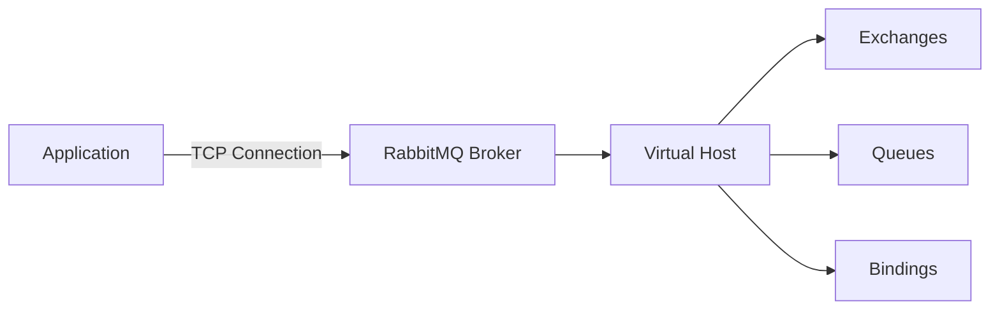

**Key Points:**
- Manages the physical network connection to RabbitMQ
- Should be long-lived and reused across operations
- Handles authentication and connection parameters
- Provides connection pooling and recovery mechanisms

### 📡 Channel
A **Channel** is a virtual connection inside a connection. Most operations are performed on channels rather than connections directly.

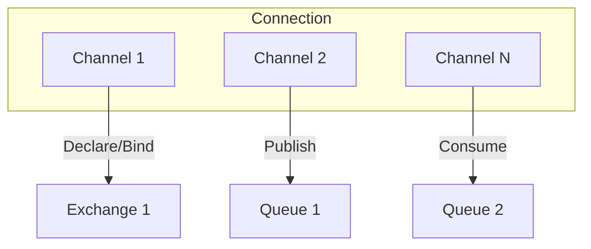

**Key Points:**
- Lightweight virtual connections that share a physical connection
- Thread-safe for publishing but not for consuming
- Used for declaring exchanges, queues, bindings
- Handle message publishing and consuming operations

### 🔄 Exchange
An **Exchange** receives messages from producers and routes them to queues based on routing rules. Different exchange types provide different routing behaviors.

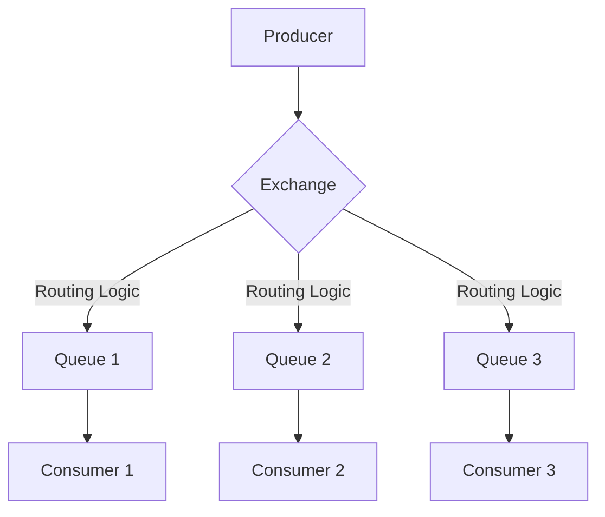

#### Exchange Types:

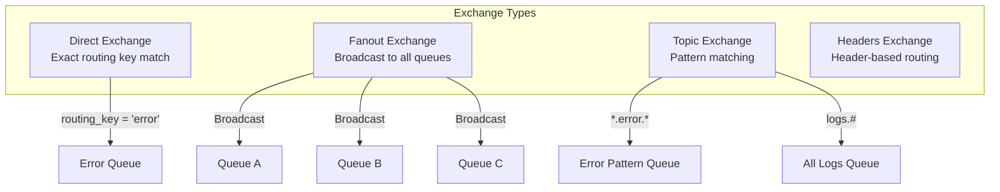

### 📬 Queue
A **Queue** stores messages until they are consumed by applications. Queues are the final destination for messages.

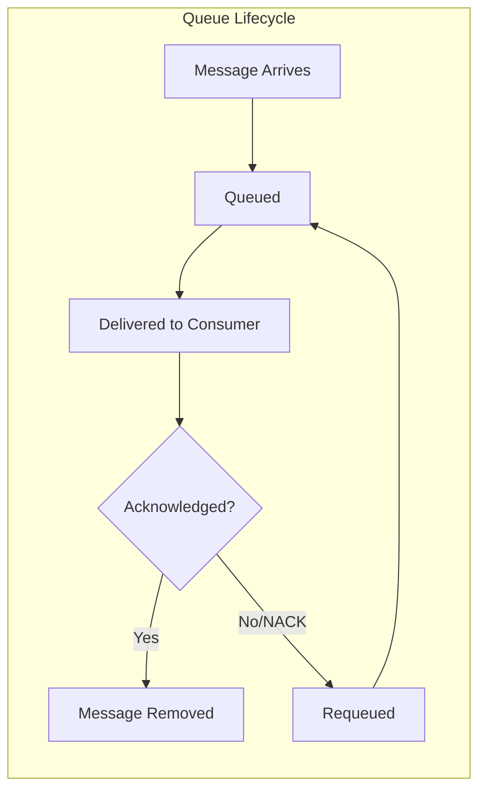

**Queue Properties:**
- **Durable**: Survives server restarts
- **Exclusive**: Used by only one connection
- **Auto-delete**: Deleted when no longer used
- **TTL**: Messages expire after specified time

### 🔗 Bindings
**Bindings** are rules that tell the exchange how to route messages to queues.

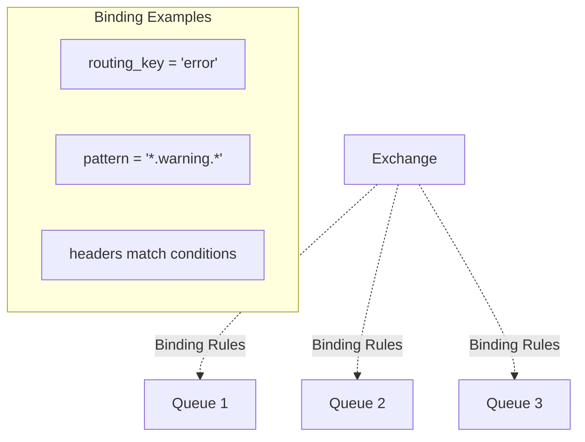

### 🏊 Streams
**Streams** are a newer RabbitMQ feature for handling high-throughput, persistent message streams with replay capabilities.

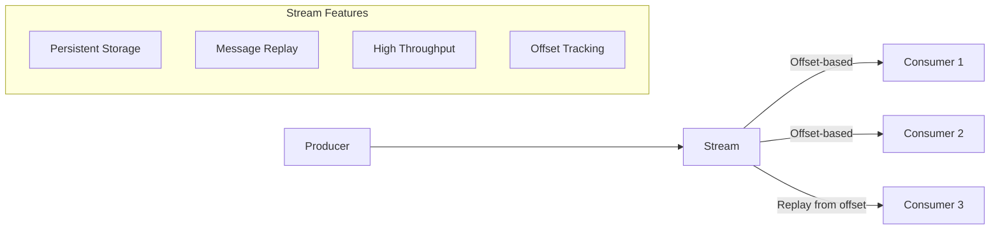

### 📤 Producer
A **Producer** is an application that sends messages to exchanges.

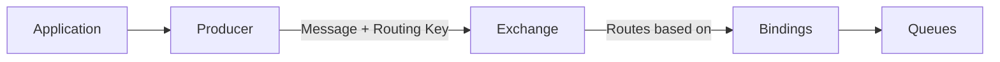

### 📥 Consumer
A **Consumer** is an application that receives messages from queues.

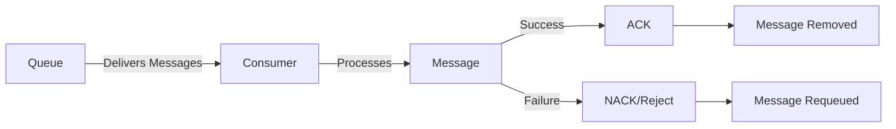

## Architecture Overview

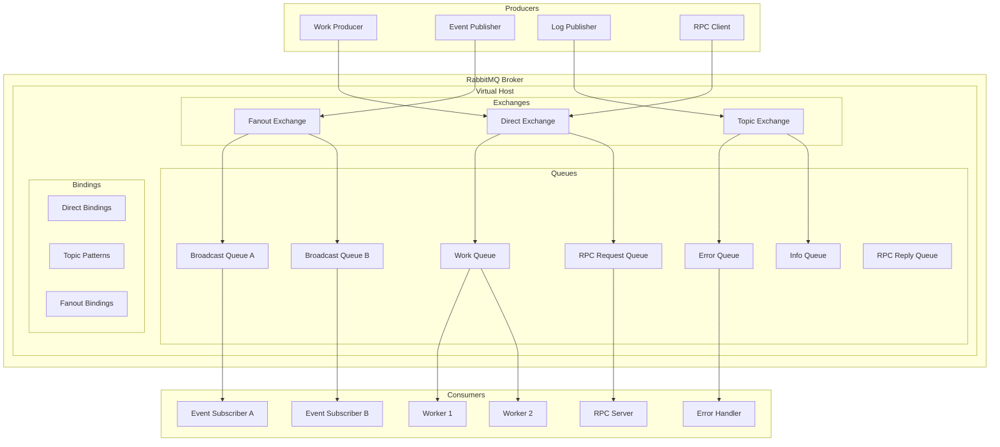

## Use Cases and Patterns

### 🎯 Use Case 1: Work Queue Pattern
**File:** [UseCase1_WorkQueue/UseCase1_README.md](UseCase1_WorkQueue/UseCase1_README.md)

**Pattern:** Simple Producer-Consumer with load balancing

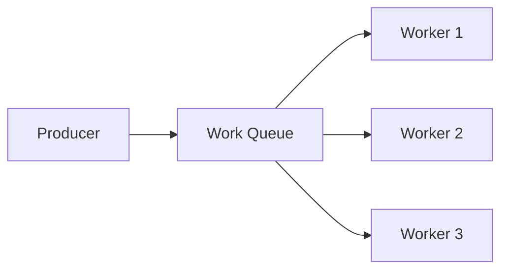

**When to Use:**
- Task distribution among multiple workers
- Load balancing computationally intensive work
- Background job processing
- Simple message queuing scenarios

**Key Features:**
- Round-robin message distribution
- Message acknowledgment patterns
- Durable queues and persistent messages
- Fair dispatch with QoS settings

---

### 📡 Use Case 2: Publish-Subscribe Pattern
**File:** [UseCase2_PublishSubscribe/UseCase2_README.md](UseCase2_PublishSubscribe/UseCase2_README.md)

**Pattern:** One-to-many broadcasting using fanout exchange

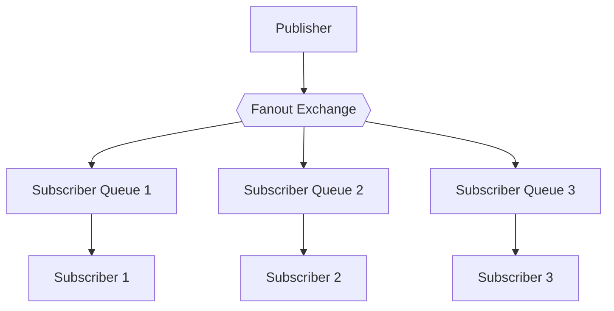

**When to Use:**
- System-wide notifications
- Event broadcasting to multiple services
- Real-time updates to multiple clients
- Microservice event distribution

**Key Features:**
- All subscribers receive all messages
- Dynamic subscription management
- Temporary exclusive queues
- Broadcast notifications

---

### 🎯 Use Case 3: Routing Pattern
**File:** [UseCase3_Routing/UseCase3_README.md](UseCase3_Routing/UseCase3_README.md)

**Pattern:** Selective routing using direct exchange with routing keys

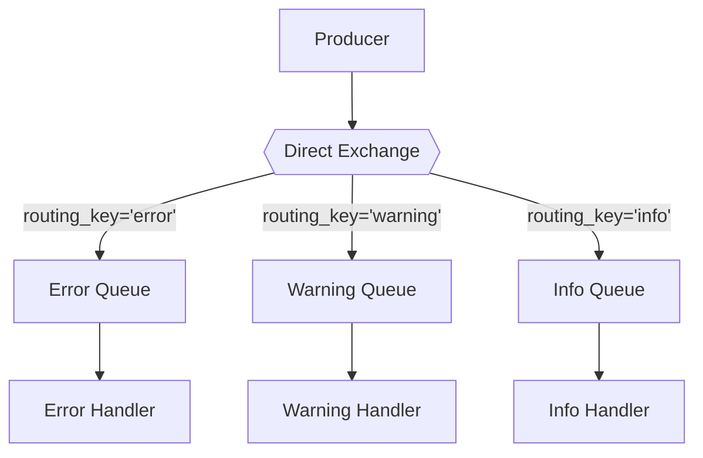

**When to Use:**
- Log message routing by severity
- Service-specific message delivery
- Conditional message processing
- Event filtering by type

**Key Features:**
- Exact routing key matching
- Multiple routing key bindings per queue
- Dynamic routing key management
- Message filtering and categorization

---

### 🌟 Use Case 4: Topic-Based Routing
**File:** [UseCase4_Topics/UseCase4_README.md](UseCase4_Topics/UseCase4_README.md)

**Pattern:** Pattern-based routing using topic exchange with wildcards

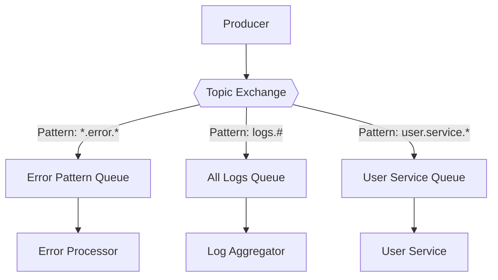

**When to Use:**
- Hierarchical message routing
- Complex filtering requirements
- Microservice event routing
- Flexible subscription patterns

**Key Features:**
- Wildcard pattern matching (* and #)
- Hierarchical routing keys
- Multiple overlapping patterns
- Dynamic pattern management

---

### 🔄 Use Case 5: Request-Reply (RPC)
**File:** [UseCase5_RPC/UseCase5_README.md](UseCase5_RPC/UseCase5_README.md)

**Pattern:** Synchronous request-response over asynchronous messaging

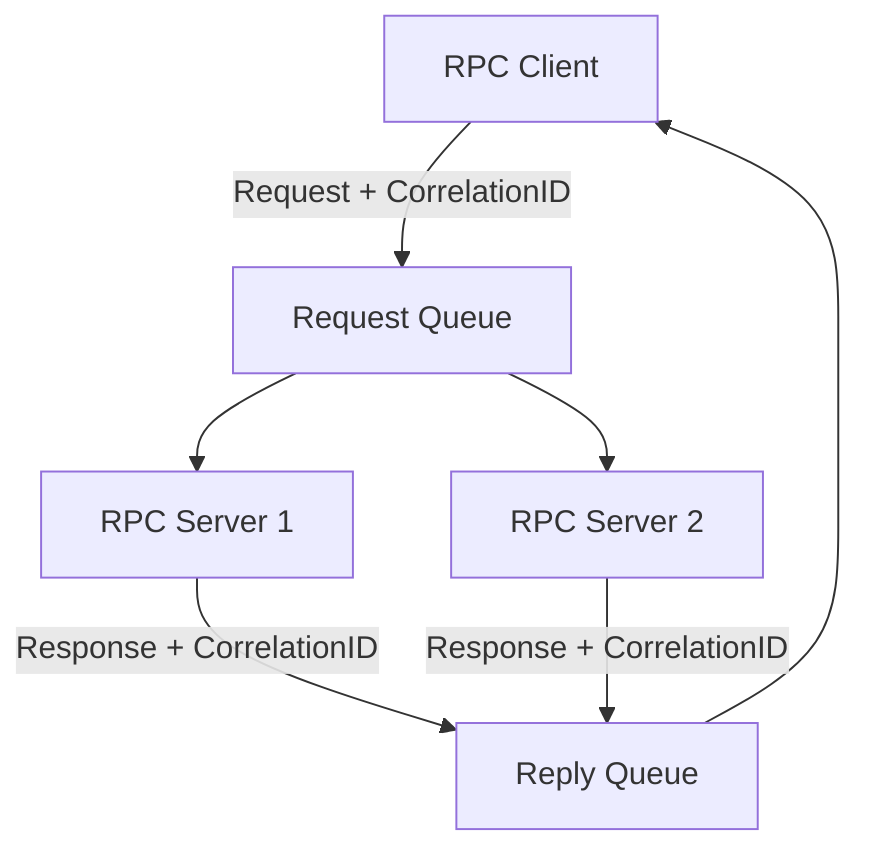

**When to Use:**
- Remote procedure calls
- Synchronous communication needs
- Request-response patterns
- Distributed computing scenarios

**Key Features:**
- Correlation ID matching
- Timeout handling
- Load balancing across servers
- Error propagation

## Getting Started

### 1. Clone and Setup
```bash
git clone <repository-url>
cd RabbitTests
```

### 2. Install Dependencies
```bash
dotnet restore
```

### 3. Start RabbitMQ Server
```bash
# Using Docker
docker run -d --hostname my-rabbit --name some-rabbit -p 5672:5672 -p 15672:15672 rabbitmq:3-management

# Or install locally and start
rabbitmq-server
```

### 4. Run Tests
```bash
# Run all tests
dotnet test

# Run specific use case
dotnet test --filter "FullyQualifiedName~UseCase1_WorkQueue"
```

### 5. Explore Examples
Each use case folder contains:
- Implementation classes (Producer/Consumer)
- Comprehensive test suite
- Demo applications
- Detailed README with examples

## Prerequisites

### Software Requirements
- **.NET 9 Runtime**: Latest .NET runtime
- **RabbitMQ Server**: Version 3.8+ (with management plugin)
- **Visual Studio 2022** or **VS Code**: For development

### RabbitMQ Setup
- **Server**: Running on `localhost:5672`
- **Management UI**: Available at `http://localhost:15672`
- **Credentials**: Default `admin/password` (or `guest/guest`)
- **Virtual Host**: Default `/` virtual host

### NuGet Packages
- `RabbitMQ.Client`: RabbitMQ .NET client library
- `Microsoft.Extensions.Logging`: For comprehensive logging
- `NUnit`: For testing framework
- `Microsoft.NET.Test.Sdk`: For test execution

## Project Structure

```
RabbitTests/
├── 📁 UseCase1_WorkQueue/          # Simple work distribution
│   ├── WorkQueueProducer.cs
│   ├── WorkQueueConsumer.cs
│   ├── WorkQueueTests.cs
│   ├── WorkQueueDemo.cs
│   └── UseCase1_README.md
├── 📁 UseCase2_PublishSubscribe/    # Broadcast messaging
│   ├── PublisherService.cs
│   ├── SubscriberService.cs
│   ├── PublishSubscribeTests.cs
│   ├── PublishSubscribeDemo.cs
│   └── UseCase2_README.md
├── 📁 UseCase3_Routing/             # Direct routing
│   ├── RoutingProducer.cs
│   ├── RoutingConsumer.cs
│   ├── RoutingTests.cs
│   └── UseCase3_README.md
├── 📁 UseCase4_Topics/              # Pattern-based routing
│   ├── TopicPublisher.cs
│   ├── TopicSubscriber.cs
│   ├── TopicTests.cs
│   └── UseCase4_README.md
├── 📁 UseCase5_RPC/                 # Request-Reply pattern
│   ├── RPCClient.cs
│   ├── RPCServer.cs
│   ├── RPCModels.cs
│   ├── RPCTests.cs
│   ├── RPCDemo.cs
│   └── UseCase5_README.md
├── 📁 Infrastructure/               # Shared utilities
│   ├── TestBase.cs
│   ├── RabbitMQConnection.cs
│   └── MessageHelpers.cs
├── RabbitTests.csproj              # Project file
└── README.md                       # This file
```

## Message Flow Comparison

```mermaid
graph TB
    subgraph "Use Case 1: Work Queue"
        UC1P[Producer] --> UC1Q[Single Queue]
        UC1Q --> UC1C1[Worker 1]
        UC1Q --> UC1C2[Worker 2]
    end
    
    subgraph "Use Case 2: Publish-Subscribe"
        UC2P[Publisher] --> UC2E{{Fanout}}
        UC2E --> UC2Q1[Queue 1]
        UC2E --> UC2Q2[Queue 2]
        UC2Q1 --> UC2S1[Sub 1]
        UC2Q2 --> UC2S2[Sub 2]
    end
    
    subgraph "Use Case 3: Routing"
        UC3P[Producer] --> UC3E{{Direct}}
        UC3E -->|error| UC3Q1[Error Q]
        UC3E -->|info| UC3Q2[Info Q]
        UC3Q1 --> UC3C1[Error Handler]
        UC3Q2 --> UC3C2[Info Handler]
    end
    
    subgraph "Use Case 4: Topics"
        UC4P[Producer] --> UC4E{{Topic}}
        UC4E -->|*.error.*| UC4Q1[Error Pattern Q]
        UC4E -->|logs.#| UC4Q2[All Logs Q]
        UC4Q1 --> UC4C1[Error Processor]
        UC4Q2 --> UC4C2[Log Aggregator]
    end
    
    subgraph "Use Case 5: RPC"
        UC5C[Client] <-->|Request/Reply| UC5S[Server]
        UC5C -.->|Correlation ID| UC5Q[Request Q]
        UC5S -.->|Response| UC5R[Reply Q]
    end
```

## Quick Reference

### Exchange Types Summary
| Exchange Type | Routing Behavior | Use Case Example |
|---------------|------------------|------------------|
| **Direct** | Exact routing key match | Use Case 3: Route by severity level |
| **Fanout** | Broadcast to all bound queues | Use Case 2: System notifications |
| **Topic** | Pattern matching with wildcards | Use Case 4: Hierarchical routing |
| **Headers** | Route based on message headers | Advanced routing scenarios |

### Pattern Comparison
| Pattern | Message Copies | Distribution | Best For |
|---------|---------------|--------------|----------|
| **Work Queue** | 1 copy, 1 consumer | Round-robin | Load balancing |
| **Publish-Subscribe** | 1 copy per subscriber | Broadcast | Event notifications |
| **Routing** | 1 copy per matching binding | Selective | Categorized processing |
| **Topics** | 1 copy per matching pattern | Pattern-based | Flexible routing |
| **RPC** | Request-response pair | Synchronous | Remote calls |

### Installaling RabbitMQ in Docker on WSL2
## install_rabbitmq_docker.sh

This script provides a comprehensive management interface for running RabbitMQ in Docker on WSL2. It handles installation, configuration, and management of a RabbitMQ instance with the management UI enabled. The script features an interactive installation process and provides detailed connection information upon completion.

### Prerequisites

- Docker must be installed and running
- WSL2 environment

### Default Configuration

- Container Name: rabbitmq
- Image: rabbitmq:3-management
- AMQP Port: 5672
- Management UI Port: 15672
- Default Username: admin
- Default Password: password
- Data Volume: rabbitmq_data

### Usage

#### Option 1: Download and Run Locally

1. Save the script to a file (e.g., `install_rabbitmq_docker.sh`)
2. Make it executable: `chmod +x install_rabbitmq_docker.sh`
3. Run the script: `./install_rabbitmq_docker.sh [command]`

#### Option 2: Run Directly from Remote URL

You can run the script directly from your GitHub repository using `curl` and `bash -c`:

```
bash -c "$(curl -fsSL https://raw.githubusercontent.com/egarim/MyWslScripts/refs/heads/master/install_rabbitmq_docker.sh)"
```

This will download and execute the latest version of `install_rabbitmq_docker.sh` from your repository.

#### Option 3: Interactive Installation

Simply run the script without any commands for an interactive installation:

```bash
./install_rabbitmq_docker.sh
```

This will check if RabbitMQ is already installed and prompt you to install it if it's not present.

## Contributing

1. Fork the repository
2. Create a feature branch
3. Add tests for new functionality
4. Ensure all tests pass
5. Submit a pull request

## License

This project is licensed under the MIT License - see the [LICENSE](LICENSE) file for details.

---

**Happy Messaging with RabbitMQ! 🐰**

For detailed examples and implementation specifics, explore the individual use case README files linked above.