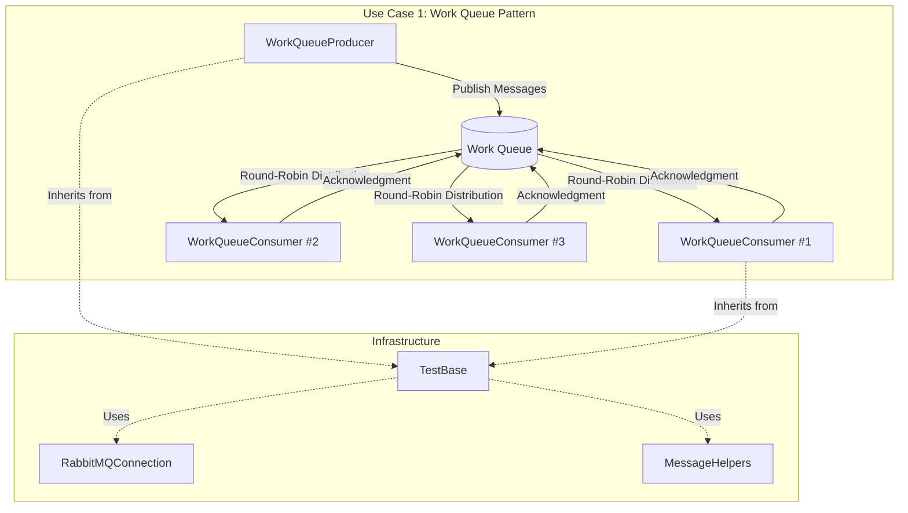
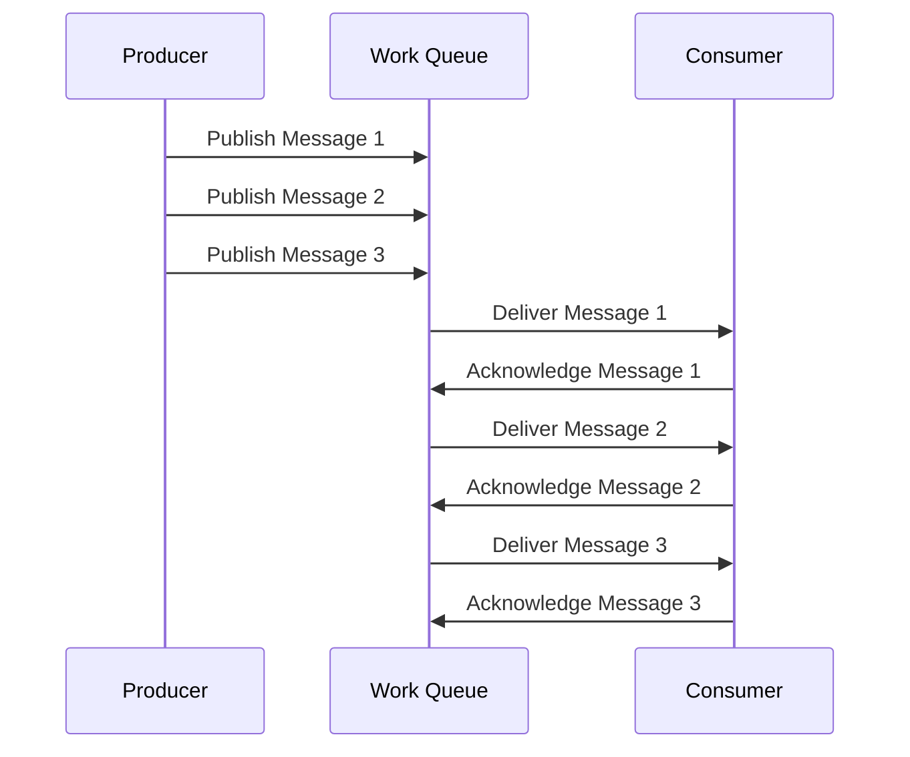
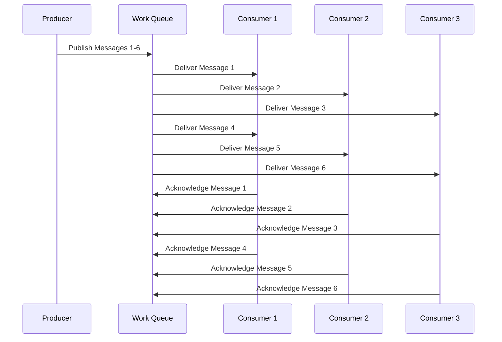
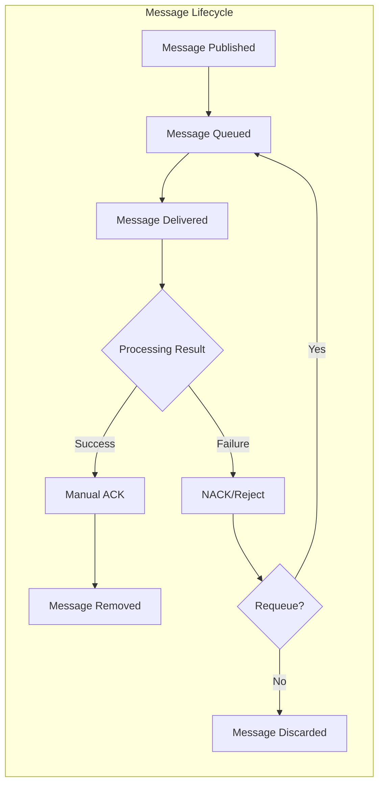
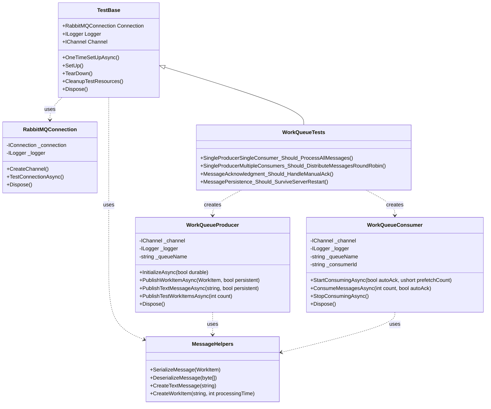

# Use Case 1: Simple Producer-Consumer Pattern (Work Queue)

## Overview
This implementation demonstrates the most basic RabbitMQ pattern where messages are sent to a queue and consumed by workers. This is also known as the **Work Queue** or **Task Queue** pattern.

## Key Concepts Demonstrated

### 1. Basic Queue Operations
- Queue declaration with different durability settings
- Message publishing to queues
- Message consumption from queues
- Proper resource cleanup

### 2. Message Distribution
- **Round-robin distribution**: Messages are distributed evenly among multiple consumers
- **Fair dispatch**: Using QoS (prefetchCount) to control message distribution
- **Load balancing**: Multiple workers processing from the same queue

### 3. Message Acknowledgment
- **Auto-acknowledgment**: Messages are acknowledged automatically when delivered
- **Manual acknowledgment**: Consumer explicitly acknowledges message processing
- **Message rejection**: Handling failed messages with requeue option

### 4. Message Persistence
- **Durable queues**: Queues that survive server restarts
- **Persistent messages**: Messages that are saved to disk
- **Temporary queues**: Auto-delete queues for testing

## Files Structure

```
RabbitTests/
??? UseCase1_WorkQueue/
?   ??? WorkQueueProducer.cs    # Publishes messages to work queue
?   ??? WorkQueueConsumer.cs    # Consumes and processes messages
?   ??? WorkQueueTests.cs       # Comprehensive test suite
?   ??? WorkQueueDemo.cs        # Interactive demonstrations
?   ??? RabbitMQConnection.cs   # Connection management utilities
?   ??? MessageHelpers.cs       # Message serialization and utilities
?   ??? UseCase1_README.md      # This documentation
??? Infrastructure/
    ??? TestBase.cs              # Base test class with setup/teardown
```

## Architecture Overview



## Message Flow Patterns

### Single Producer - Single Consumer


### Single Producer - Multiple Consumers (Round-Robin)


### Message Acknowledgment Flow


## Class Relationships



## Core Classes

### WorkQueueProducer
Responsible for publishing messages to the work queue.

**Key Features:**
- Initialize queues with different durability settings
- Publish individual messages or batches
- Support for persistent messages
- Text messages and structured WorkItem objects

**Example Usage:**
```csharp
var producer = new WorkQueueProducer(channel, logger, "my-work-queue");
await producer.InitializeAsync(durable: false);
await producer.PublishTestMessagesAsync(10, persistent: false);
```

### WorkQueueConsumer
Consumes and processes messages from the work queue.

**Key Features:**
- Configurable acknowledgment modes (auto/manual)
- QoS control for fair message distribution
- Processing statistics and monitoring
- Event-driven message processing
- Graceful shutdown and cleanup

**Example Usage:**
```csharp
var consumer = new WorkQueueConsumer(channel, logger, "my-work-queue", "worker-1");
await consumer.StartConsumingAsync(autoAck: false, prefetchCount: 1);

// Process specific number of messages
var messages = await consumer.ConsumeMessagesAsync(5, autoAck: false);
```

## Test Scenarios

### 1. SingleProducerSingleConsumer
- **Purpose**: Verify basic message flow
- **Test**: Send 10 messages, consume all with one consumer
- **Validation**: All messages are received and processed

### 2. SingleProducerMultipleConsumers  
- **Purpose**: Demonstrate round-robin distribution
- **Test**: Send 20 messages, consume with 3 consumers
- **Validation**: Messages are distributed evenly among consumers

### 3. MessageAcknowledgment
- **Purpose**: Test acknowledgment mechanisms
- **Test**: Compare manual vs auto acknowledgment
- **Validation**: Messages are acknowledged correctly

### 4. MessagePersistence
- **Purpose**: Verify persistence and durability
- **Test**: Durable queues with persistent messages
- **Validation**: Messages survive and are processed correctly

### 5. WorkItem Processing
- **Purpose**: Simulate real workload scenarios
- **Test**: Process structured work items with timing
- **Validation**: Processing time and statistics are accurate

## Usage Examples

### Basic Producer-Consumer
```csharp
// Create producer
var producer = new WorkQueueProducer(channel, logger);
await producer.InitializeAsync();

// Create consumer
var consumer = new WorkQueueConsumer(channel, logger);
consumer.OnMessageProcessed += (message, workItem) => {
    Console.WriteLine($"Processed: {message}");
};

// Publish messages
await producer.PublishTestMessagesAsync(5);

// Start consuming
await consumer.StartConsumingAsync(autoAck: true);
```

### Multiple Workers
```csharp
// Create multiple consumers
var consumers = new List<WorkQueueConsumer>();
for (int i = 1; i <= 3; i++)
{
    var consumer = new WorkQueueConsumer(channel, logger, "work-queue", $"worker-{i}");
    consumers.Add(consumer);
    await consumer.StartConsumingAsync(autoAck: false, prefetchCount: 1);
}

// Publish work
await producer.PublishTestWorkItemsAsync(15);

// Work is automatically distributed among consumers
```

### Persistent Messages
```csharp
// Create durable queue
await producer.InitializeAsync(durable: true);

// Publish persistent messages
var workItems = new[] {
    MessageHelpers.CreateWorkItem("Critical Task 1"),
    MessageHelpers.CreateWorkItem("Critical Task 2")
};
await producer.PublishWorkItemsAsync(workItems, persistent: true);

// Messages will survive server restarts
```

## Configuration Options

### Producer Configuration
- **Queue Name**: Custom queue name for the work queue
- **Durability**: Whether the queue survives server restarts
- **Persistence**: Whether messages are saved to disk
- **Batch Size**: Number of messages to publish at once

### Consumer Configuration  
- **Consumer ID**: Unique identifier for the consumer
- **Auto Acknowledgment**: Automatic vs manual message acknowledgment
- **Prefetch Count**: Number of unacknowledged messages per consumer
- **Processing Timeout**: Maximum time to wait for messages

## Best Practices Demonstrated

1. **Resource Management**: Proper disposal of connections and channels
2. **Error Handling**: Graceful handling of connection failures and processing errors
3. **Logging**: Comprehensive logging for debugging and monitoring
4. **Testing**: Thorough test coverage with different scenarios
5. **Performance**: Efficient message processing with QoS controls
6. **Reliability**: Message acknowledgment and persistence for critical scenarios

## Running the Tests

```bash
# Run all Use Case 1 tests
dotnet test --filter "TestFixture=WorkQueueTests"

# Run specific test
dotnet test --filter "TestMethod=SingleProducerSingleConsumer_Should_ProcessAllMessages"
```

## Prerequisites

- RabbitMQ server running on localhost:5672
- Admin user credentials (admin/password)
- .NET 9 runtime
- RabbitMQ.Client NuGet package

## Performance Considerations

- **Connection Pooling**: Reuse connections across multiple operations
- **Channel Management**: Use separate channels for producers and consumers  
- **Batch Processing**: Group multiple messages for better throughput
- **QoS Settings**: Configure prefetch count based on processing capacity
- **Memory Usage**: Monitor queue depths and consumer processing rates

This implementation provides a solid foundation for understanding RabbitMQ work queues and serves as a starting point for more complex messaging patterns.