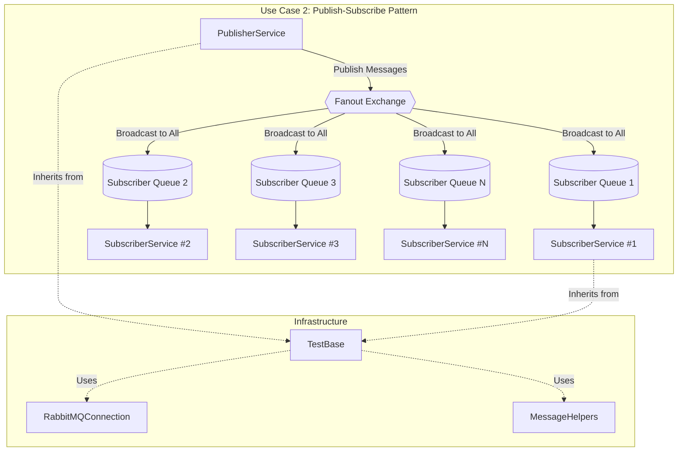
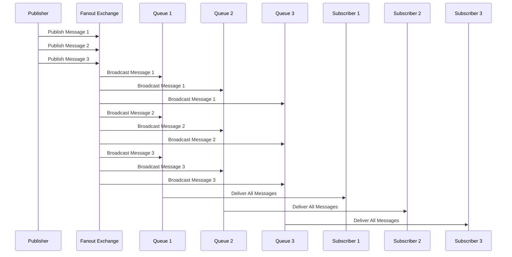
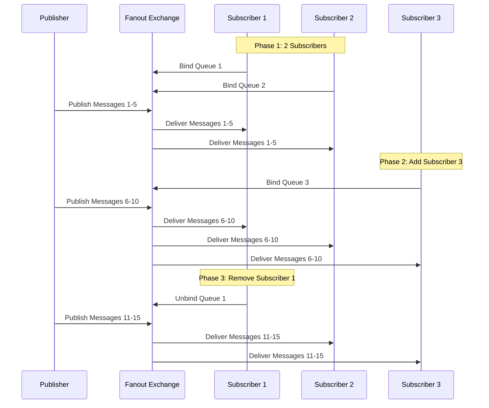
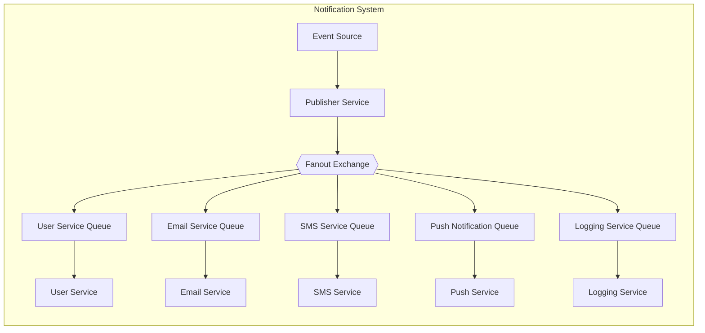
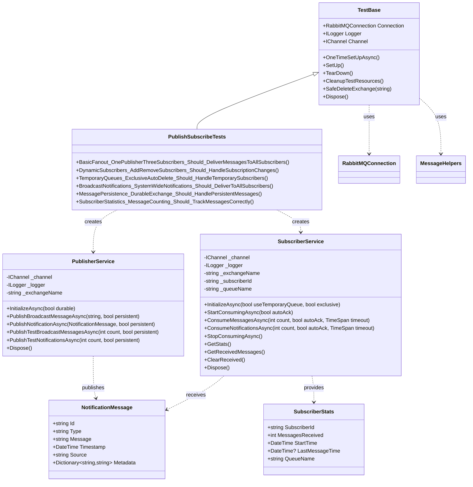

# Use Case 2: Publish-Subscribe Pattern (Fanout Exchange)

## Overview
This implementation demonstrates the **Publish-Subscribe** messaging pattern using RabbitMQ's fanout exchanges. In this pattern, messages are broadcast to multiple consumers simultaneously, enabling one-to-many communication where each subscriber receives a copy of every published message.

## Key Concepts Demonstrated

### 1. Fanout Exchange Operations
- Fanout exchange declaration and configuration
- Broadcasting messages to all bound queues
- Exchange durability and message persistence
- Temporary vs permanent exchange management

### 2. Dynamic Subscription Management
- **Multiple subscribers**: Multiple consumers receiving identical messages
- **Dynamic subscription**: Adding/removing subscribers during runtime
- **Temporary queues**: Exclusive, auto-delete queues for subscribers
- **Load balancing**: Each subscriber gets all messages (not distributed)

### 3. Message Broadcasting
- **Fanout routing**: Messages sent to all bound queues regardless of routing key
- **Simultaneous delivery**: All subscribers receive messages concurrently
- **Message isolation**: Each subscriber has its own queue and message copy

### 4. Queue Types and Binding
- **Exclusive queues**: Private queues for individual subscribers
- **Temporary queues**: Auto-generated, auto-delete queues
- **Queue binding**: Connecting queues to fanout exchange
- **Connection lifecycle**: Queue cleanup on subscriber disconnect

## Files Structure

```
RabbitTests/
??? UseCase2_PublishSubscribe/
?   ??? PublisherService.cs       # Broadcasts messages to fanout exchange
?   ??? SubscriberService.cs      # Subscribes and receives broadcast messages
?   ??? PublishSubscribeTests.cs  # Comprehensive test suite
?   ??? UseCase2_README.md        # This documentation
??? Infrastructure/
    ??? TestBase.cs               # Base test class with setup/teardown
    ??? RabbitMQConnection.cs     # Connection management utilities
    ??? MessageHelpers.cs         # Message serialization and utilities
```

## Architecture Overview



## Message Flow Patterns

### Single Publisher - Multiple Subscribers (Fanout)


### Dynamic Subscription Management


### Notification Broadcasting


## Class Relationships



## Core Classes

### PublisherService
Responsible for publishing messages to the fanout exchange for broadcasting.

**Key Features:**
- Initialize fanout exchanges with different durability settings
- Broadcast text messages and structured notifications
- Support for persistent message publishing
- Batch message publishing with configurable delays

**Example Usage:**
```csharp
var publisher = new PublisherService(channel, logger, "broadcast-exchange");
await publisher.InitializeAsync(durable: false);
await publisher.PublishTestBroadcastMessagesAsync(10, persistent: false);
```

### SubscriberService
Subscribes to and consumes broadcast messages from the fanout exchange.

**Key Features:**
- Exclusive temporary queue creation and management
- Dynamic subscription (start/stop consuming)
- Statistics tracking and monitoring
- Support for both text messages and structured notifications
- Event-driven message processing

**Example Usage:**
```csharp
var subscriber = new SubscriberService(channel, logger, "broadcast-exchange", "service-1");
await subscriber.InitializeAsync(useTemporaryQueue: true, exclusive: true);
await subscriber.StartConsumingAsync(autoAck: true);

// Or consume specific number of messages
var messages = await subscriber.ConsumeMessagesAsync(5, autoAck: true, TimeSpan.FromSeconds(30));
```

## Test Scenarios

### 1. BasicFanout
- **Purpose**: Verify basic fanout broadcasting behavior
- **Test**: One publisher broadcasts to three subscribers
- **Validation**: All subscribers receive all messages identically

### 2. DynamicSubscribers
- **Purpose**: Test dynamic subscription management
- **Test**: Add/remove subscribers during active publishing
- **Validation**: Only active subscribers receive messages

### 3. TemporaryQueues
- **Purpose**: Verify exclusive auto-delete queue behavior
- **Test**: Use system-generated temporary queues
- **Validation**: Queues are properly created and cleaned up

### 4. BroadcastNotifications
- **Purpose**: Simulate real-world system-wide notifications
- **Test**: Broadcast different notification types to multiple services
- **Validation**: All services receive all notification types

### 5. MessagePersistence
- **Purpose**: Test durability and persistence features
- **Test**: Durable exchange with persistent messages
- **Validation**: Messages and exchange configurations persist correctly

### 6. SubscriberStatistics
- **Purpose**: Verify subscriber monitoring and statistics
- **Test**: Track message counts, timing, and subscriber info
- **Validation**: Statistics accurately reflect subscriber activity

## Usage Examples

### Basic Publisher-Subscriber
```csharp
// Create publisher
var publisher = new PublisherService(channel, logger);
await publisher.InitializeAsync();

// Create multiple subscribers
var subscribers = new List<SubscriberService>();
for (int i = 1; i <= 3; i++)
{
    var subscriber = new SubscriberService(channel, logger, "test-exchange", $"service-{i}");
    await subscriber.InitializeAsync();
    await subscriber.StartConsumingAsync(autoAck: true);
    subscribers.Add(subscriber);
}

// Broadcast messages - all subscribers will receive them
await publisher.PublishTestBroadcastMessagesAsync(10);
```

### System-Wide Notifications
```csharp
// Publisher for system events
var eventPublisher = new PublisherService(channel, logger, "system-events");
await eventPublisher.InitializeAsync(durable: true);

// Services subscribing to system events
var userService = new SubscriberService(channel, logger, "system-events", "UserService");
var orderService = new SubscriberService(channel, logger, "system-events", "OrderService");
var emailService = new SubscriberService(channel, logger, "system-events", "EmailService");

// Each service gets its own queue and receives all events
await userService.InitializeAsync();
await orderService.InitializeAsync();
await emailService.InitializeAsync();

// Broadcast system-wide notification
var notification = new NotificationMessage
{
    Id = Guid.NewGuid().ToString(),
    Type = "SYSTEM_MAINTENANCE",
    Message = "System will be down for maintenance in 30 minutes",
    Timestamp = DateTime.UtcNow,
    Source = "MaintenanceService"
};

await eventPublisher.PublishNotificationAsync(notification, persistent: true);
```

### Dynamic Subscription Management
```csharp
// Start with initial subscribers
var coreServices = new List<SubscriberService>
{
    new(channel, logger, "events", "CoreService1"),
    new(channel, logger, "events", "CoreService2")
};

foreach (var service in coreServices)
{
    await service.InitializeAsync();
    await service.StartConsumingAsync();
}

// Add optional services later
var optionalService = new SubscriberService(channel, logger, "events", "OptionalService");
await optionalService.InitializeAsync();
await optionalService.StartConsumingAsync();

// Remove services dynamically
await coreServices[0].StopConsumingAsync();
```

### Monitoring and Statistics
```csharp
var subscriber = new SubscriberService(channel, logger, "monitoring", "MonitoredService");
await subscriber.InitializeAsync();

// Set up event handlers
subscriber.OnMessageReceived += (message, subscriberId) => {
    Console.WriteLine($"[{subscriberId}] Received: {message}");
};

subscriber.OnError += (exception, subscriberId) => {
    Console.WriteLine($"[{subscriberId}] Error: {exception.Message}");
};

await subscriber.StartConsumingAsync();

// Get statistics
var stats = subscriber.GetStats();
Console.WriteLine($"Service: {stats.SubscriberId}");
Console.WriteLine($"Messages: {stats.MessagesReceived}");
Console.WriteLine($"Queue: {stats.QueueName}");
Console.WriteLine($"Last Message: {stats.LastMessageTime}");
```

## Configuration Options

### Publisher Configuration
- **Exchange Name**: Custom name for the fanout exchange
- **Durability**: Whether the exchange survives server restarts
- **Message Persistence**: Whether individual messages are saved to disk
- **Publishing Delays**: Configurable delays between message publishing

### Subscriber Configuration
- **Subscriber ID**: Unique identifier for the subscriber service
- **Queue Type**: Temporary vs permanent, exclusive vs shared
- **Auto Acknowledgment**: Automatic vs manual message acknowledgment
- **Consumption Timeout**: Maximum time to wait for messages

## Best Practices Demonstrated

1. **Resource Management**: Proper disposal of subscribers and queue cleanup
2. **Error Handling**: Graceful handling of connection failures and processing errors
3. **Logging**: Comprehensive logging for debugging and monitoring
4. **Testing**: Thorough test coverage with realistic scenarios
5. **Scalability**: Support for dynamic subscriber management
6. **Reliability**: Message acknowledgment and persistence for critical scenarios
7. **Monitoring**: Statistics tracking for operational insights

## Common Use Cases

### 1. System-Wide Notifications
- User registration confirmations
- System maintenance announcements
- Security alerts
- Configuration changes

### 2. Event Broadcasting
- Real-time data updates
- Cache invalidation signals
- Microservice communication
- Activity logging

### 3. Multi-Service Coordination
- Deployment notifications
- Health check broadcasts
- Configuration updates
- Service discovery events

### 4. Monitoring and Alerting
- Performance metrics broadcasting
- Error notifications
- Resource usage alerts
- System status updates

## Running the Tests

```bash
# Run all Use Case 2 tests
dotnet test --filter "TestFixture=PublishSubscribeTests"

# Run specific test
dotnet test --filter "TestMethod=BasicFanout_OnePublisherThreeSubscribers_Should_DeliverMessagesToAllSubscribers"

# Run tests with detailed output
dotnet test --filter "TestFixture=PublishSubscribeTests" --verbosity normal
```

## Prerequisites

- RabbitMQ server running on localhost:5672
- Admin user credentials (admin/password)
- .NET 9 runtime
- RabbitMQ.Client NuGet package

## Performance Considerations

- **Connection Sharing**: Use shared connections across multiple subscribers
- **Queue Management**: Monitor queue depths and subscriber processing rates
- **Message Size**: Consider message size impact on broadcasting performance
- **Subscriber Count**: Test system limits with large numbers of subscribers
- **Network Bandwidth**: Account for N-times message duplication across subscribers
- **Memory Usage**: Monitor memory consumption with temporary queues

## Comparison with Work Queue Pattern

| Aspect | Work Queue (Use Case 1) | Publish-Subscribe (Use Case 2) |
|--------|------------------------|--------------------------------|
| **Message Distribution** | Round-robin among workers | Broadcast to all subscribers |
| **Queue Type** | Single shared queue | Multiple exclusive queues |
| **Use Case** | Load balancing work | Event notification/broadcasting |
| **Scaling** | Add workers for throughput | Add subscribers for coverage |
| **Message Copies** | One copy consumed once | One copy per subscriber |
| **Exchange Type** | Default (direct) | Fanout |

This implementation provides a comprehensive foundation for understanding RabbitMQ publish-subscribe patterns and serves as a building block for more complex messaging architectures involving event-driven systems and microservice communication.