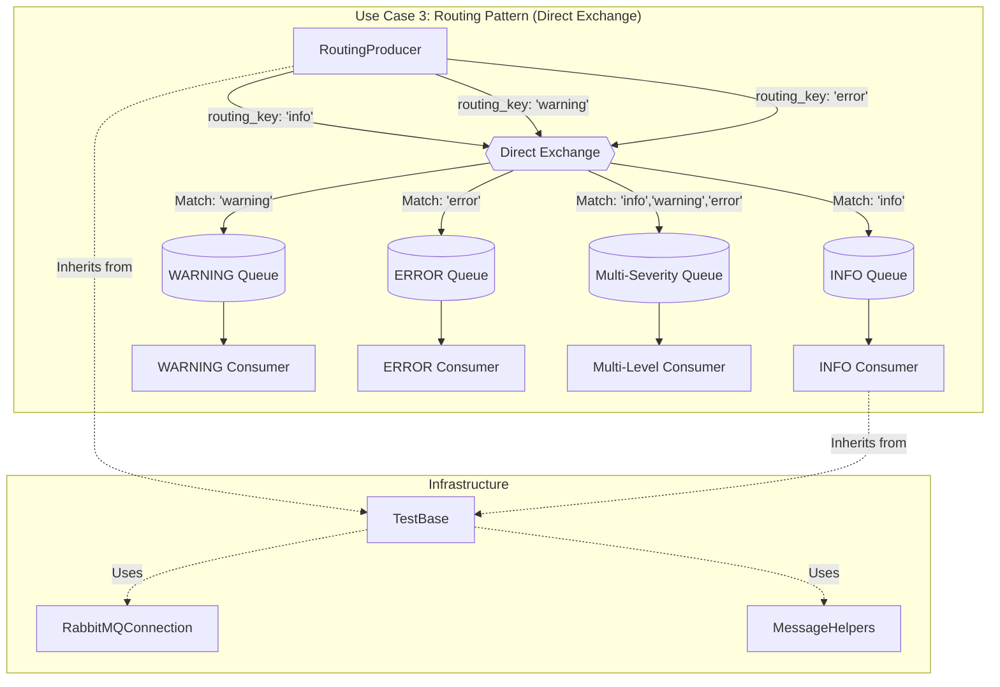
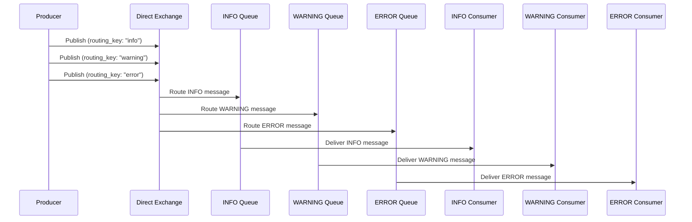
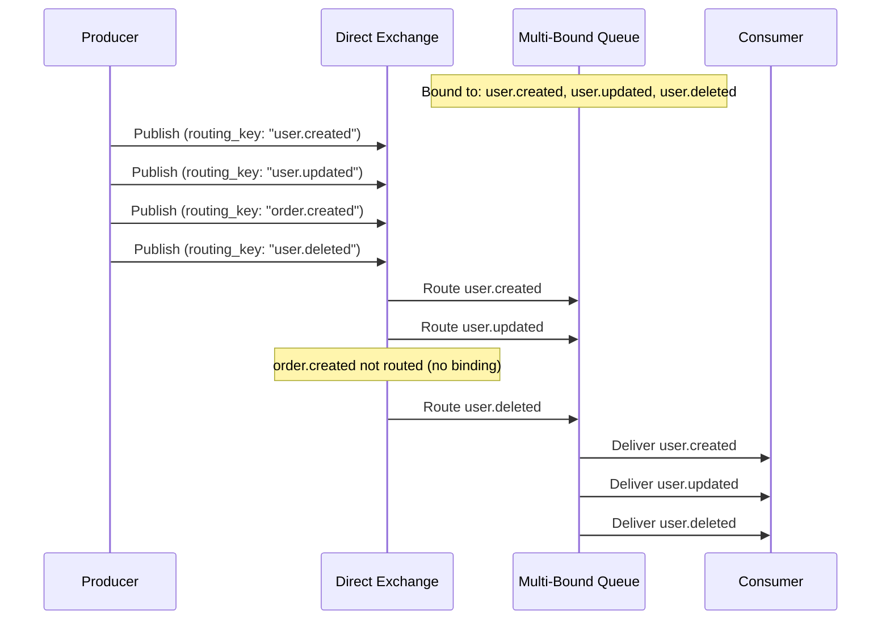
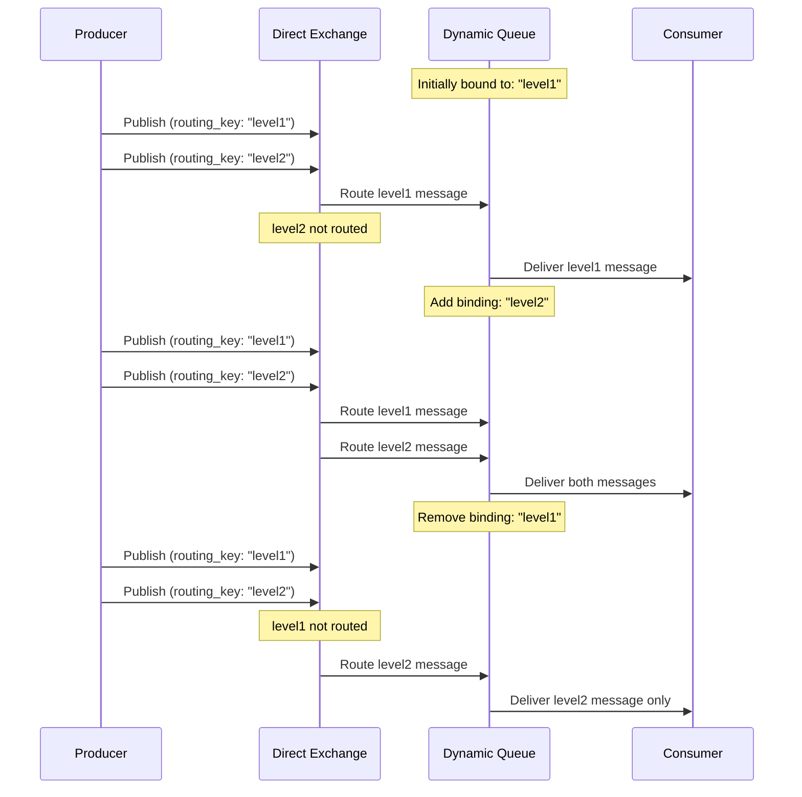
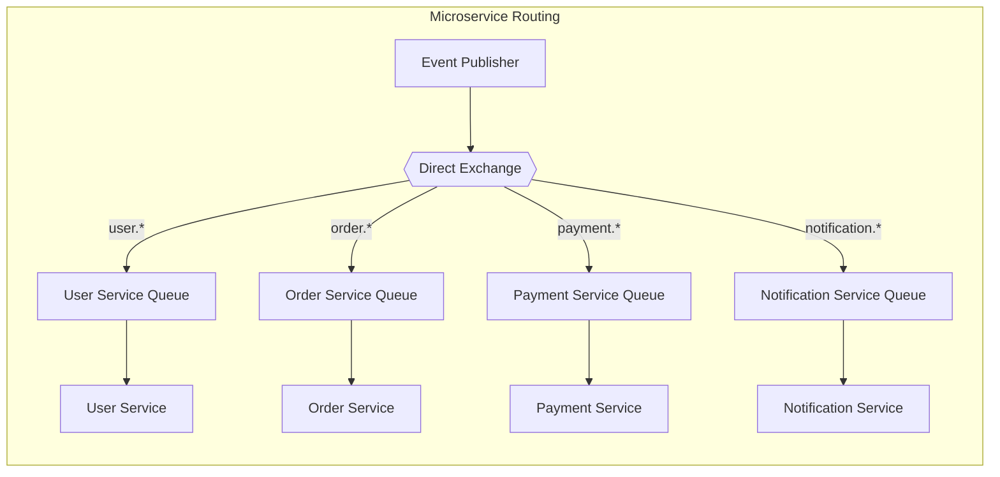
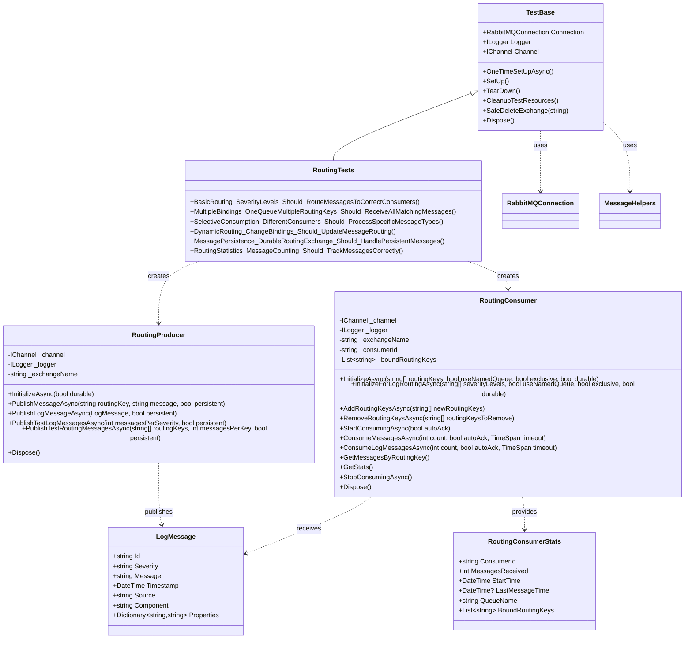

# Use Case 3: Routing Pattern (Direct Exchange)

## Overview
This implementation demonstrates the **Routing Pattern** using RabbitMQ's direct exchanges. In this pattern, messages are published with specific routing keys and are delivered only to queues that are bound with matching routing keys, enabling selective message routing and filtering.

## Key Concepts Demonstrated

### 1. Direct Exchange Operations
- Direct exchange declaration and configuration
- Routing key-based message delivery
- Selective message filtering based on exact routing key matches
- Exchange durability and message persistence

### 2. Routing Key Management
- **Exact matching**: Messages delivered only to queues with matching routing keys
- **Multiple bindings**: One queue can bind to multiple routing keys
- **Dynamic routing**: Adding and removing routing key bindings at runtime
- **Selective consumption**: Different consumers for different message types

### 3. Message Routing Strategies
- **Severity-based routing**: Log messages routed by severity level (info, warning, error)
- **Service-based routing**: Messages routed to specific microservices
- **Event-type routing**: Different event types routed to appropriate handlers
- **Dynamic subscription**: Runtime changes to routing subscriptions

### 4. Advanced Routing Features
- **Multiple queue bindings**: Single exchange routing to multiple specialized queues
- **Routing key patterns**: Hierarchical routing keys for organized message flow
- **Consumer specialization**: Different consumers handling specific message categories
- **Message filtering**: Only relevant messages reach each consumer

## Files Structure

```
RabbitTests/
??? UseCase3_Routing/
?   ??? RoutingProducer.cs      # Publishes messages with routing keys to direct exchange
?   ??? RoutingConsumer.cs      # Consumes messages based on routing key bindings
?   ??? RoutingTests.cs         # Comprehensive test suite
?   ??? UseCase3_README.md      # This documentation
??? Infrastructure/
    ??? TestBase.cs             # Base test class with setup/teardown
    ??? RabbitMQConnection.cs   # Connection management utilities
    ??? MessageHelpers.cs       # Message serialization and utilities
```

## Architecture Overview



## Message Flow Patterns

### Severity-Based Routing


### Multiple Binding Pattern


### Dynamic Routing Changes


### Service-Specific Routing


## Class Relationships



## Core Classes

### RoutingProducer
Responsible for publishing messages with specific routing keys to the direct exchange.

**Key Features:**
- Initialize direct exchanges with different durability settings
- Publish messages with custom routing keys
- Support for structured log messages with severity-based routing
- Batch message publishing with different routing keys
- Support for persistent message publishing

**Example Usage:**
```csharp
var producer = new RoutingProducer(channel, logger, "routing-exchange");
await producer.InitializeAsync(durable: false);

// Publish with specific routing key
await producer.PublishMessageAsync("user.created", "User John Doe created", persistent: false);

// Publish log messages (routing key = severity)
var logMessage = new LogMessage
{
    Severity = "ERROR",
    Message = "Database connection failed",
    Source = "UserService"
};
await producer.PublishLogMessageAsync(logMessage);
```

### RoutingConsumer
Consumes messages from the direct exchange based on routing key bindings.

**Key Features:**
- Bind to single or multiple routing keys
- Dynamic routing key management (add/remove bindings)
- Severity-based log message consumption
- Statistics tracking with routing key breakdown
- Support for both temporary and named queues
- Event-driven message processing

**Example Usage:**
```csharp
var consumer = new RoutingConsumer(channel, logger, "routing-exchange", "error-handler");

// Bind to specific routing keys
await consumer.InitializeAsync(new[] { "error", "critical" });

// Or bind to severity levels for logging
await consumer.InitializeForLogRoutingAsync(new[] { "ERROR", "WARNING" });

// Start consuming
await consumer.StartConsumingAsync(autoAck: true);

// Process specific number of messages
var messages = await consumer.ConsumeMessagesAsync(10, autoAck: false, TimeSpan.FromSeconds(30));
```

## Test Scenarios

### 1. BasicRouting
- **Purpose**: Verify basic routing by severity levels
- **Test**: Route INFO, WARNING, ERROR messages to specific consumers
- **Validation**: Each consumer receives only messages with matching routing keys

### 2. MultipleBindings
- **Purpose**: Test one queue bound to multiple routing keys
- **Test**: Single consumer bound to multiple order-related routing keys
- **Validation**: Consumer receives messages from all bound routing keys

### 3. SelectiveConsumption
- **Purpose**: Demonstrate service-specific message routing
- **Test**: Different consumers for user, order, and payment services
- **Validation**: Each service receives only relevant messages

### 4. DynamicRouting
- **Purpose**: Test runtime changes to routing key bindings
- **Test**: Add and remove routing key bindings during message flow
- **Validation**: Message routing changes dynamically with binding changes

### 5. MessagePersistence
- **Purpose**: Verify persistence with routing
- **Test**: Durable exchange with persistent routed messages
- **Validation**: Messages and routing configurations persist correctly

### 6. RoutingStatistics
- **Purpose**: Verify routing statistics and monitoring
- **Test**: Track message counts per routing key
- **Validation**: Statistics accurately reflect routing key distribution

## Usage Examples

### Basic Severity-Based Routing
```csharp
// Create producer
var producer = new RoutingProducer(channel, logger, "log-exchange");
await producer.InitializeAsync();

// Create consumers for different severity levels
var errorConsumer = new RoutingConsumer(channel, logger, "log-exchange", "error-handler");
var warningConsumer = new RoutingConsumer(channel, logger, "log-exchange", "warning-handler");

await errorConsumer.InitializeForLogRoutingAsync(new[] { "ERROR" });
await warningConsumer.InitializeForLogRoutingAsync(new[] { "WARNING" });

// Start consuming
await errorConsumer.StartConsumingAsync();
await warningConsumer.StartConsumingAsync();

// Publish log messages
await producer.PublishLogMessageAsync(new LogMessage
{
    Severity = "ERROR",
    Message = "Critical system failure",
    Source = "DatabaseService"
});
```

### Microservice Event Routing
```csharp
// Set up service-specific consumers
var userService = new RoutingConsumer(channel, logger, "events", "UserService");
var orderService = new RoutingConsumer(channel, logger, "events", "OrderService");
var paymentService = new RoutingConsumer(channel, logger, "events", "PaymentService");

// Bind to service-specific routing keys
await userService.InitializeAsync(new[] { "user.created", "user.updated", "user.deleted" });
await orderService.InitializeAsync(new[] { "order.created", "order.shipped", "order.completed" });
await paymentService.InitializeAsync(new[] { "payment.processed", "payment.failed" });

// Publish events with appropriate routing keys
var eventProducer = new RoutingProducer(channel, logger, "events");
await eventProducer.PublishMessageAsync("user.created", "User ID 123 created");
await eventProducer.PublishMessageAsync("order.shipped", "Order ID 456 shipped");
await eventProducer.PublishMessageAsync("payment.processed", "Payment ID 789 processed");
```

### Dynamic Routing Management
```csharp
var consumer = new RoutingConsumer(channel, logger, "dynamic-routing", "adaptive-consumer");

// Start with basic routing keys
await consumer.InitializeAsync(new[] { "basic.info" });

// Add more routing keys as needed
await consumer.AddRoutingKeysAsync(new[] { "advanced.info", "critical.alerts" });

// Remove routing keys that are no longer needed
await consumer.RemoveRoutingKeysAsync(new[] { "basic.info" });

// Check current bindings
var stats = consumer.GetStats();
Console.WriteLine($"Currently bound to: {string.Join(", ", stats.BoundRoutingKeys)}");
```

### Multiple Bindings Pattern
```csharp
// Single consumer handling multiple related message types
var orderProcessor = new RoutingConsumer(channel, logger, "orders", "order-processor");

await orderProcessor.InitializeAsync(new[] {
    "order.created",
    "order.updated", 
    "order.cancelled",
    "order.shipped",
    "order.delivered"
});

// Producer sends various order events
var orderProducer = new RoutingProducer(channel, logger, "orders");
await orderProducer.PublishMessageAsync("order.created", "New order from customer");
await orderProducer.PublishMessageAsync("order.shipped", "Order dispatched");

// Consumer receives all order-related messages
var messages = await orderProcessor.ConsumeMessagesAsync(10);
var messagesByType = orderProcessor.GetMessagesByRoutingKey();
```

### Monitoring and Statistics
```csharp
var consumer = new RoutingConsumer(channel, logger, "monitoring", "metrics-collector");
await consumer.InitializeAsync(new[] { "metrics.cpu", "metrics.memory", "metrics.disk" });

// Set up event handlers for monitoring
consumer.OnMessageReceived += (message, routingKey, consumerId) => {
    Console.WriteLine($"[{consumerId}] Received {routingKey}: {message}");
    
    // Process metrics based on routing key
    switch (routingKey)
    {
        case "metrics.cpu":
            ProcessCpuMetrics(message);
            break;
        case "metrics.memory":
            ProcessMemoryMetrics(message);
            break;
        case "metrics.disk":
            ProcessDiskMetrics(message);
            break;
    }
};

await consumer.StartConsumingAsync();

// Get detailed statistics
var stats = consumer.GetStats();
var messageBreakdown = consumer.GetMessagesByRoutingKey();

Console.WriteLine($"Consumer: {stats.ConsumerId}");
Console.WriteLine($"Total Messages: {stats.MessagesReceived}");
Console.WriteLine($"Bound Routing Keys: {string.Join(", ", stats.BoundRoutingKeys)}");

foreach (var kvp in messageBreakdown)
{
    Console.WriteLine($"Routing Key '{kvp.Key}': {kvp.Value.Count} messages");
}
```

## Configuration Options

### Producer Configuration
- **Exchange Name**: Custom name for the direct exchange
- **Durability**: Whether the exchange survives server restarts
- **Message Persistence**: Whether individual messages are saved to disk
- **Routing Key Strategy**: Custom routing key generation logic

### Consumer Configuration
- **Consumer ID**: Unique identifier for the consumer
- **Routing Keys**: Array of routing keys to bind to
- **Queue Type**: Named vs temporary, exclusive vs shared
- **Auto Acknowledgment**: Automatic vs manual message acknowledgment
- **Dynamic Binding**: Runtime addition/removal of routing keys

## Best Practices Demonstrated

1. **Resource Management**: Proper disposal of consumers and queue cleanup
2. **Error Handling**: Graceful handling of connection failures and processing errors
3. **Logging**: Comprehensive logging for debugging and monitoring with routing context
4. **Testing**: Thorough test coverage with realistic routing scenarios
5. **Scalability**: Support for dynamic routing key management
6. **Reliability**: Message acknowledgment and persistence for critical scenarios
7. **Monitoring**: Statistics tracking with routing key breakdown
8. **Flexibility**: Support for different routing patterns and use cases

## Common Use Cases

### 1. Log Aggregation and Processing
- Route log messages by severity level
- Different processors for different log types
- Critical error escalation
- Debug information filtering

### 2. Microservice Event Routing
- Service-specific event delivery
- Domain-driven message routing
- Cross-service communication
- Event sourcing patterns

### 3. Task Distribution
- Route tasks to specialized workers
- Priority-based task routing
- Workload categorization
- Resource-specific assignment

### 4. Notification Systems
- Route notifications by type or priority
- User preference-based routing
- Channel-specific delivery
- Alert escalation paths

## Running the Tests

```bash
# Run all Use Case 3 tests
dotnet test --filter "FullyQualifiedName~RoutingTests"

# Run specific test
dotnet test --filter "TestMethod=BasicRouting_SeverityLevels_Should_RouteMessagesToCorrectConsumers"

# Run tests with detailed output
dotnet test --filter "FullyQualifiedName~RoutingTests" --verbosity normal
```

## Prerequisites

- RabbitMQ server running on localhost:5672
- Admin user credentials (admin/password)
- .NET 9 runtime
- RabbitMQ.Client NuGet package

## Performance Considerations

- **Routing Key Design**: Use meaningful, hierarchical routing keys
- **Binding Management**: Monitor the number of bindings per queue
- **Message Volume**: Consider routing key distribution for load balancing
- **Exchange Performance**: Direct exchanges are very efficient for exact matches
- **Memory Usage**: Monitor queue depths per routing key
- **Connection Sharing**: Use shared connections across multiple consumers

## Comparison with Other Patterns

| Aspect | Work Queue (Use Case 1) | Publish-Subscribe (Use Case 2) | Routing (Use Case 3) |
|--------|------------------------|--------------------------------|---------------------|
| **Message Distribution** | Round-robin among workers | Broadcast to all subscribers | Selective by routing key |
| **Queue Type** | Single shared queue | Multiple exclusive queues | Multiple queues with specific bindings |
| **Use Case** | Load balancing work | Event notification/broadcasting | Selective message filtering |
| **Scaling** | Add workers for throughput | Add subscribers for coverage | Add consumers for specific message types |
| **Message Copies** | One copy consumed once | One copy per subscriber | One copy per matching binding |
| **Exchange Type** | Default (direct) | Fanout | Direct |
| **Routing Logic** | None (queue-based) | None (broadcast all) | Exact routing key match |

This implementation provides a comprehensive foundation for understanding RabbitMQ routing patterns and serves as a building block for more complex messaging architectures involving selective message processing and microservice communication.