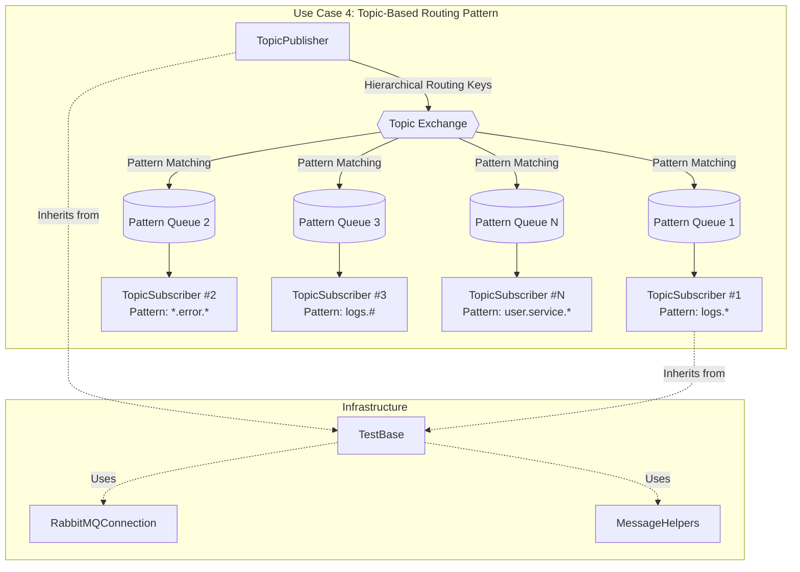
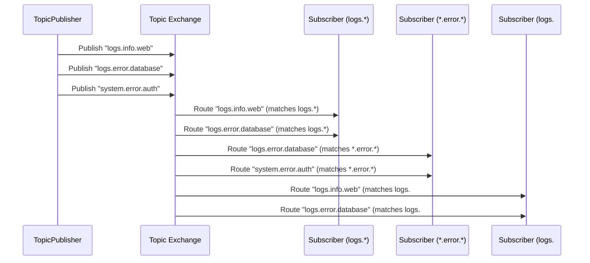
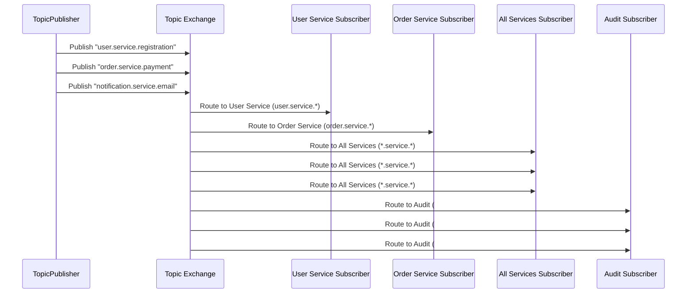
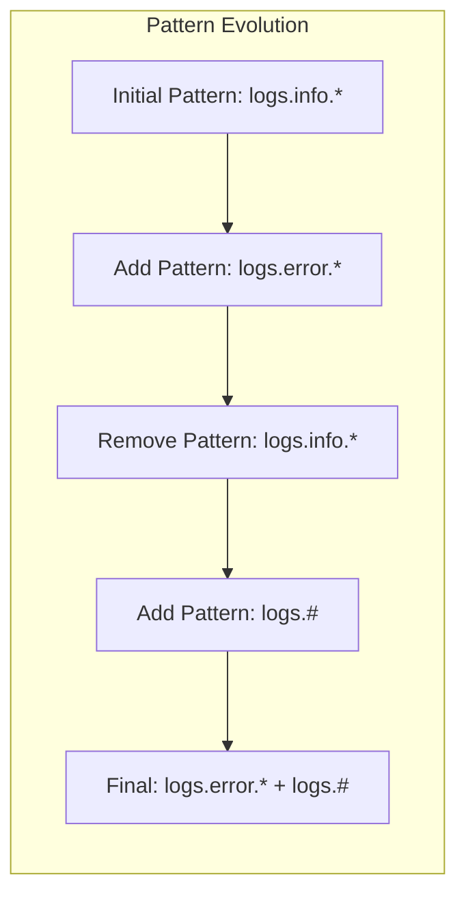
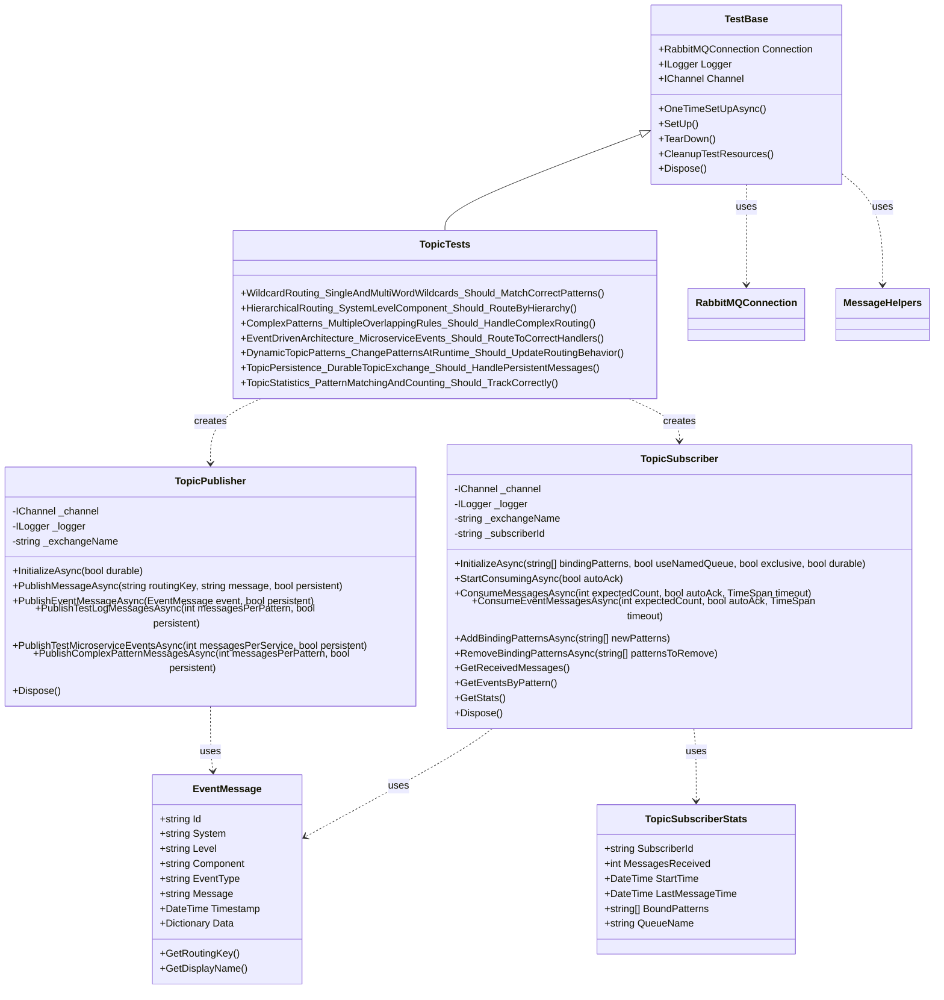

# Use Case 4: Topic-Based Routing (Topic Exchange)

## Overview
This implementation demonstrates the **Topic-Based Routing** messaging pattern using RabbitMQ's topic exchanges. In this pattern, messages are published with hierarchical routing keys and consumers use wildcard patterns to selectively receive messages, enabling flexible and powerful routing scenarios common in event-driven architectures and complex logging systems.

## Key Concepts Demonstrated

### 1. Topic Exchange Operations
- Topic exchange declaration and configuration
- Hierarchical routing keys (e.g., "logs.error.database")
- Pattern-based message routing using wildcards
- Exchange durability and message persistence

### 2. Wildcard Pattern Matching
- **Single-word wildcard (*)**: Matches exactly one word in routing key
- **Multi-word wildcard (#)**: Matches zero or more words in routing key
- **Complex patterns**: Combining wildcards with exact words
- **Pattern precedence**: Handling overlapping routing patterns

### 3. Hierarchical Message Routing
- **System.Level.Component**: Three-tier hierarchical routing
- **Event-driven architecture**: Microservice event routing
- **Selective subscription**: Fine-grained message filtering
- **Dynamic binding**: Adding/removing patterns at runtime

### 4. Advanced Routing Scenarios
- **Multiple patterns**: Single consumer with multiple binding patterns
- **Overlapping patterns**: Complex routing rules with pattern overlap
- **Pattern matching logic**: Custom pattern validation and routing
- **Performance optimization**: Efficient pattern matching algorithms

## Files Structure

```
RabbitTests/
??? UseCase4_Topics/
    ??? TopicPublisher.cs       # Publishes messages with hierarchical routing keys
    ??? TopicSubscriber.cs      # Subscribes using wildcard patterns
    ??? TopicTests.cs          # Comprehensive test suite
    ??? UseCase4_README.md     # This documentation
??? Infrastructure/
    ??? TestBase.cs            # Base test class with setup/teardown
    ??? RabbitMQConnection.cs  # Connection management utilities
    ??? MessageHelpers.cs      # Message serialization and utilities
```

## Architecture Overview



## Message Flow Patterns

### Topic-Based Routing with Wildcards


### Hierarchical Event Routing


### Dynamic Pattern Management


## Class Relationships



## Core Classes

### TopicPublisher
Responsible for publishing messages with hierarchical routing keys to topic exchanges.

**Key Features:**
- Initialize topic exchanges with different durability settings
- Publish messages with custom routing keys
- Support for structured EventMessage objects
- Complex pattern message publishing for testing
- Persistent message support

**Example Usage:**
```csharp
var publisher = new TopicPublisher(channel, logger, "my-topic-exchange");
await publisher.InitializeAsync(durable: false);

// Publish with simple routing key
await publisher.PublishMessageAsync("logs.error.database", "Database connection failed", false);

// Publish structured event
var eventMessage = new EventMessage
{
    System = "user",
    Level = "service", 
    Component = "authentication",
    EventType = "LoginFailed",
    Message = "Invalid credentials provided"
};
await publisher.PublishEventMessageAsync(eventMessage, persistent: true);
```

### TopicSubscriber
Consumes messages from topic exchanges using wildcard pattern matching.

**Key Features:**
- Configurable wildcard pattern bindings (* and # wildcards)
- Multiple pattern support per subscriber
- Dynamic pattern management (add/remove at runtime)
- Event-driven message processing
- Pattern-specific message tracking and statistics

**Example Usage:**
```csharp
var subscriber = new TopicSubscriber(channel, logger, "my-topic-exchange", "error-handler");

// Initialize with multiple patterns
await subscriber.InitializeAsync(new[] { "*.error.*", "logs.warning.#" });

// Consume specific number of messages
var messages = await subscriber.ConsumeMessagesAsync(10, autoAck: false);

// Add new patterns dynamically
await subscriber.AddBindingPatternsAsync(new[] { "system.critical.*" });

// Get statistics
var stats = subscriber.GetStats();
var messagesByPattern = subscriber.GetMessagesByPattern();
```

### EventMessage
Represents structured events with hierarchical routing support.

**Key Features:**
- System.Level.Component hierarchy
- Automatic routing key generation
- Metadata support with custom data
- Timestamp tracking
- Event type classification

## Test Scenarios

### 1. WildcardRouting_SingleAndMultiWordWildcards_Should_MatchCorrectPatterns
- **Purpose**: Verify wildcard pattern matching (* and #)
- **Test**: Publish log messages, verify pattern-based routing
- **Validation**: Correct messages reach appropriate subscribers

### 2. HierarchicalRouting_SystemLevelComponent_Should_RouteByHierarchy
- **Purpose**: Demonstrate microservice event routing
- **Test**: Route events by system.level.component hierarchy
- **Validation**: Events reach correct service handlers

### 3. ComplexPatterns_MultipleOverlappingRules_Should_HandleComplexRouting
- **Purpose**: Test complex overlapping routing patterns
- **Test**: Multiple subscribers with overlapping pattern rules
- **Validation**: Messages correctly routed to all matching patterns

### 4. EventDrivenArchitecture_MicroserviceEvents_Should_RouteToCorrectHandlers
- **Purpose**: Simulate real-world microservice communication
- **Test**: Route events between user, order, inventory, and audit services
- **Validation**: Event types and systems correctly filtered

### 5. DynamicTopicPatterns_ChangePatternsAtRuntime_Should_UpdateRoutingBehavior
- **Purpose**: Test runtime pattern management
- **Test**: Add/remove binding patterns during execution
- **Validation**: Routing behavior changes correctly

### 6. TopicPersistence_DurableTopicExchange_Should_HandlePersistentMessages
- **Purpose**: Verify persistence and durability features
- **Test**: Durable exchanges with persistent messages
- **Validation**: Messages survive and are processed correctly

### 7. TopicStatistics_PatternMatchingAndCounting_Should_TrackCorrectly
- **Purpose**: Validate pattern matching statistics
- **Test**: Track message counts per pattern
- **Validation**: Statistics accurately reflect message distribution

## Usage Examples

### Basic Topic Routing
```csharp
// Create publisher
var publisher = new TopicPublisher(channel, logger, "logs-exchange");
await publisher.InitializeAsync();

// Create subscriber for error logs
var errorSubscriber = new TopicSubscriber(channel, logger, "logs-exchange", "error-handler");
await errorSubscriber.InitializeAsync(new[] { "*.error.*" });

// Publish messages
await publisher.PublishMessageAsync("web.error.timeout", "Request timeout occurred");
await publisher.PublishMessageAsync("db.error.connection", "Database connection failed");
await publisher.PublishMessageAsync("web.info.startup", "Web server started"); // Won't match

// Consume matching messages
var errorMessages = await errorSubscriber.ConsumeMessagesAsync(2);
```

### Microservice Event Routing
```csharp
// Create event publisher
var eventPublisher = new TopicPublisher(channel, logger, "microservices-events");
await eventPublisher.InitializeAsync();

// Create service-specific subscribers
var userServiceSubscriber = new TopicSubscriber(channel, logger, "microservices-events", "user-service");
var orderServiceSubscriber = new TopicSubscriber(channel, logger, "microservices-events", "order-service");
var auditSubscriber = new TopicSubscriber(channel, logger, "microservices-events", "audit-service");

await userServiceSubscriber.InitializeAsync(new[] { "user.#" });
await orderServiceSubscriber.InitializeAsync(new[] { "order.#" });
await auditSubscriber.InitializeAsync(new[] { "#" }); // All events

// Publish microservice events
await eventPublisher.PublishTestMicroserviceEventsAsync(messagesPerService: 5);

// Services automatically receive relevant events
```

### Dynamic Pattern Management
```csharp
// Start with basic pattern
var dynamicSubscriber = new TopicSubscriber(channel, logger, "logs", "dynamic-handler");
await dynamicSubscriber.InitializeAsync(new[] { "logs.info.*" });

// Later add error handling
await dynamicSubscriber.AddBindingPatternsAsync(new[] { "logs.error.*", "logs.warning.*" });

// Remove info pattern, keep error/warning
await dynamicSubscriber.RemoveBindingPatternsAsync(new[] { "logs.info.*" });

// Add catch-all for debugging
await dynamicSubscriber.AddBindingPatternsAsync(new[] { "logs.debug.#" });
```

## Configuration Options

### Publisher Configuration
- **Exchange Name**: Custom topic exchange name
- **Durability**: Whether the exchange survives server restarts
- **Persistence**: Whether messages are saved to disk
- **Routing Key Strategy**: Custom hierarchical routing key patterns

### Subscriber Configuration
- **Subscriber ID**: Unique identifier for the subscriber
- **Binding Patterns**: Array of wildcard patterns to subscribe to
- **Queue Type**: Named vs temporary, exclusive vs shared
- **Acknowledgment Mode**: Auto vs manual message acknowledgment
- **QoS Settings**: Prefetch count for fair message distribution

## Pattern Matching Rules

### Single-word Wildcard (*)
- Matches exactly one word in the routing key
- `logs.*.web` matches: `logs.error.web`, `logs.info.web`
- Does not match: `logs.web`, `logs.error.web.server`

### Multi-word Wildcard (#)
- Matches zero or more words in the routing key
- `logs.#` matches: `logs`, `logs.error`, `logs.error.web.server`
- `user.service.#` matches: `user.service.auth`, `user.service.auth.login.success`

### Combined Patterns
- `*.error.#` matches: `web.error.timeout`, `db.error.connection.lost`
- `logs.*.database` matches: `logs.error.database`, `logs.warning.database`

## Best Practices Demonstrated

1. **Hierarchical Design**: Use consistent System.Level.Component routing keys
2. **Pattern Strategy**: Design patterns for overlap and specificity balance
3. **Resource Management**: Proper disposal of publishers and subscribers
4. **Error Handling**: Graceful handling of pattern mismatches and failures
5. **Performance**: Efficient pattern matching and message routing
6. **Monitoring**: Statistics tracking for pattern effectiveness
7. **Flexibility**: Dynamic pattern management for changing requirements

## Running the Tests

```bash
# Run all Use Case 4 tests
dotnet test --filter "TestFixture=TopicTests"

# Run specific test
dotnet test --filter "TestMethod=WildcardRouting_SingleAndMultiWordWildcards_Should_MatchCorrectPatterns"

# Run with detailed output
dotnet test --filter "FullyQualifiedName~UseCase4_Topics" --verbosity normal
```

## Prerequisites

- RabbitMQ server running on localhost:5672
- Admin user credentials (admin/password)
- .NET 9 runtime
- RabbitMQ.Client NuGet package

## Performance Considerations

- **Pattern Complexity**: Simple patterns perform better than complex overlapping ones
- **Exchange Management**: Topic exchanges are optimized for pattern matching
- **Queue Strategy**: Use exclusive queues for single consumers, shared for load balancing
- **Memory Usage**: Monitor pattern count and message retention
- **Connection Sharing**: Reuse connections across multiple publishers/subscribers
- **Binding Management**: Minimize binding changes during high message throughput

## Real-World Applications

- **Logging Systems**: Route logs by severity, component, and system
- **Event-Driven Architecture**: Microservice communication and event handling
- **Monitoring**: Route metrics and alerts by system and criticality
- **Notification Systems**: Selective notification delivery based on user preferences
- **Data Processing**: Route data streams to appropriate processing pipelines

This implementation provides a comprehensive foundation for understanding RabbitMQ topic exchanges and serves as a robust starting point for complex event-driven messaging architectures.