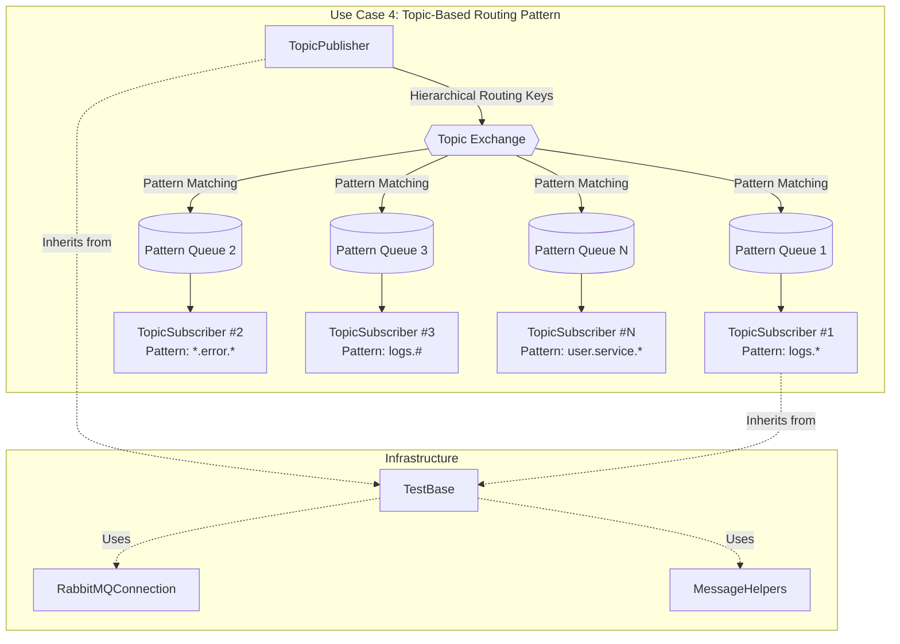
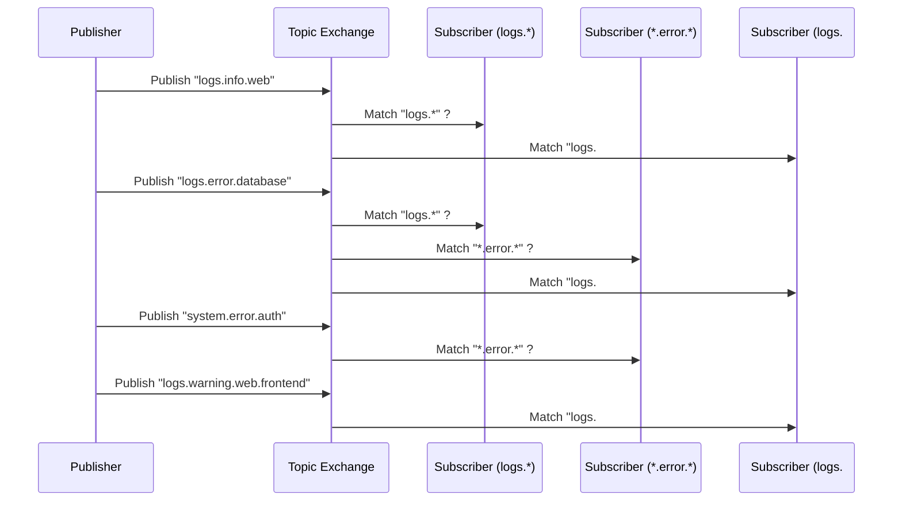
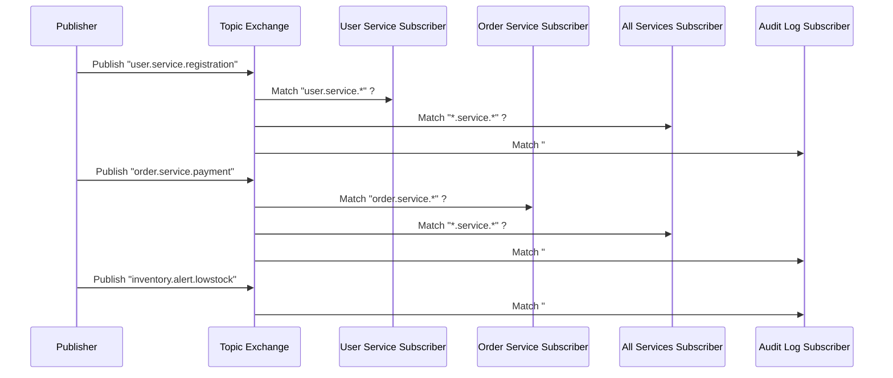
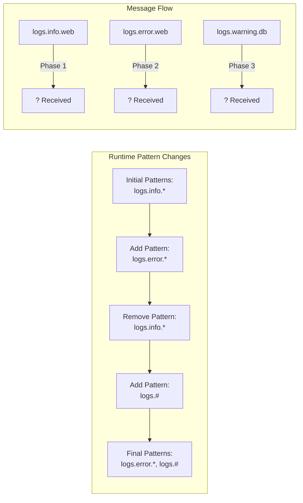
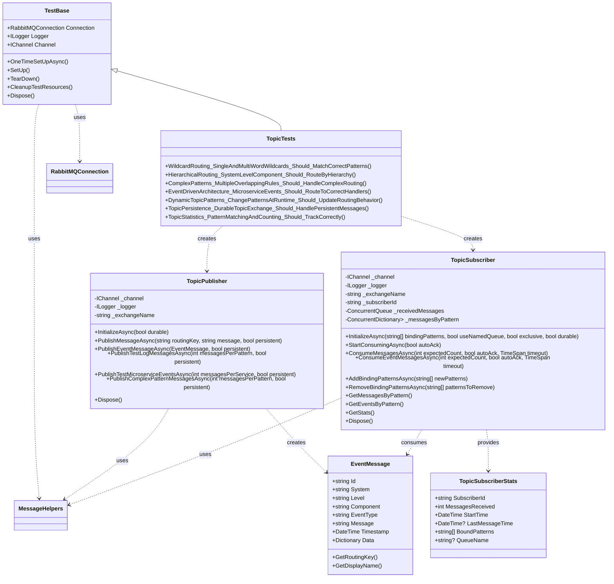

# Use Case 4: Topic-Based Routing (Topic Exchange)

## Overview
This implementation demonstrates the **Topic-Based Routing** messaging pattern using RabbitMQ's topic exchanges. In this pattern, messages are published with hierarchical routing keys and consumers use wildcard patterns to selectively receive messages, enabling flexible and powerful routing scenarios common in event-driven architectures and complex logging systems.

## Key Concepts Demonstrated

### 1. Topic Exchange Operations
- Topic exchange declaration and configuration
- Hierarchical routing keys (e.g., "logs.error.database")
- Pattern-based message routing using wildcards
- Exchange durability and message persistence

### 2. Wildcard Pattern Matching
- **Single-word wildcard (**)**: Matches exactly one word in routing key
- **Multi-word wildcard (#)**: Matches zero or more words in routing key
- **Complex patterns**: Combining wildcards with exact words
- **Pattern precedence**: Handling overlapping routing patterns

### 3. Hierarchical Message Routing
- **System.Level.Component**: Three-tier hierarchical routing
- **Event-driven architecture**: Microservice event routing
- **Selective subscription**: Fine-grained message filtering
- **Dynamic binding**: Adding/removing patterns at runtime

### 4. Advanced Routing Scenarios
- **Multiple patterns**: Single consumer with multiple binding patterns
- **Overlapping patterns**: Complex routing rules with pattern overlap
- **Pattern matching logic**: Custom pattern validation and routing
- **Performance optimization**: Efficient pattern matching algorithms

## Files Structure

```
RabbitTests/
??? UseCase4_Topics/
?   ??? TopicPublisher.cs       # Publishes messages with hierarchical routing keys
?   ??? TopicSubscriber.cs      # Subscribes using wildcard patterns
?   ??? TopicTests.cs          # Comprehensive test suite
?   ??? UseCase4_README.md     # This documentation
??? Infrastructure/
    ??? TestBase.cs            # Base test class with setup/teardown
    ??? RabbitMQConnection.cs  # Connection management utilities
    ??? MessageHelpers.cs      # Message serialization and utilities
```

## Architecture Overview



## Message Flow Patterns

### Wildcard Pattern Matching


### Hierarchical Event Routing


### Dynamic Pattern Management


## Class Relationships



## Core Classes

### TopicPublisher
Responsible for publishing messages with hierarchical routing keys to topic exchanges.

**Key Features:**
- Initialize topic exchanges with different durability settings
- Publish messages with hierarchical routing keys
- Support for persistent messages and event objects
- Specialized methods for different message types (logs, events, complex patterns)
- Built-in test data generation for various scenarios

**Example Usage:**
```csharp
var publisher = new TopicPublisher(channel, logger, "my-topic-exchange");
await publisher.InitializeAsync(durable: false);

// Publish hierarchical log message
await publisher.PublishMessageAsync("logs.error.database", "Database connection failed", persistent: false);

// Publish structured event message
var eventMessage = new EventMessage 
{
    System = "user", 
    Level = "service", 
    Component = "registration",
    EventType = "UserRegistered"
};
await publisher.PublishEventMessageAsync(eventMessage, persistent: true);
```

### TopicSubscriber
Consumes messages from topic exchanges using wildcard pattern matching.

**Key Features:**
- Subscribe using wildcard patterns (* and # wildcards)
- Dynamic pattern management (add/remove patterns at runtime)
- Pattern-specific message collection and statistics
- Event-driven and polling consumption models
- Comprehensive pattern matching logic
- Performance monitoring and statistics

**Example Usage:**
```csharp
var subscriber = new TopicSubscriber(channel, logger, "my-topic-exchange", "log-subscriber");

// Initialize with wildcard patterns
await subscriber.InitializeAsync(new[] { "logs.error.*", "*.warning.*", "system.#" });

// Start consuming asynchronously
await subscriber.StartConsumingAsync(autoAck: false);

// Or consume specific number of messages
var messages = await subscriber.ConsumeMessagesAsync(10, autoAck: true, TimeSpan.FromSeconds(30));

// Dynamic pattern management
await subscriber.AddBindingPatternsAsync(new[] { "alerts.#" });
await subscriber.RemoveBindingPatternsAsync(new[] { "logs.error.*" });
```

## Test Scenarios

### 1. WildcardRouting_SingleAndMultiWordWildcards
- **Purpose**: Verify wildcard pattern matching (* and #)
- **Test**: Multiple subscribers with different wildcard patterns
- **Validation**: Messages routed correctly based on pattern matching

### 2. HierarchicalRouting_SystemLevelComponent
- **Purpose**: Test hierarchical routing with system.level.component structure
- **Test**: Microservice events with hierarchical routing keys
- **Validation**: Events delivered to appropriate service handlers

### 3. ComplexPatterns_MultipleOverlappingRules
- **Purpose**: Handle complex, overlapping routing patterns
- **Test**: Multiple subscribers with overlapping patterns
- **Validation**: Correct message delivery with pattern precedence

### 4. EventDrivenArchitecture_MicroserviceEvents
- **Purpose**: Simulate real-world event-driven architecture
- **Test**: Multiple microservices publishing and consuming events
- **Validation**: Events routed to correct handlers and audit logs

### 5. DynamicTopicPatterns_ChangePatternsAtRuntime
- **Purpose**: Test dynamic pattern management during runtime
- **Test**: Add/remove patterns while consuming messages
- **Validation**: Routing behavior updates correctly with pattern changes

### 6. TopicPersistence_DurableTopicExchange
- **Purpose**: Verify persistence and durability features
- **Test**: Durable exchanges with persistent messages
- **Validation**: Messages survive and are processed correctly

### 7. TopicStatistics_PatternMatchingAndCounting
- **Purpose**: Validate statistics and performance monitoring
- **Test**: Track message counts, pattern matches, and timing
- **Validation**: Statistics accuracy and performance metrics

## Usage Examples

### Basic Wildcard Subscription
```csharp
// Create publisher
var publisher = new TopicPublisher(channel, logger);
await publisher.InitializeAsync();

// Create subscribers with different patterns
var errorLogSubscriber = new TopicSubscriber(channel, logger, "topic-exchange", "error-logs");
await errorLogSubscriber.InitializeAsync(new[] { "logs.error.*" });

var allWebSubscriber = new TopicSubscriber(channel, logger, "topic-exchange", "all-web");
await allWebSubscriber.InitializeAsync(new[] { "*.*.web" });

// Publish hierarchical messages
await publisher.PublishMessageAsync("logs.error.database", "Database error occurred");
await publisher.PublishMessageAsync("logs.info.web", "Web request processed");

// Start consuming
await errorLogSubscriber.StartConsumingAsync(autoAck: true);
await allWebSubscriber.StartConsumingAsync(autoAck: true);
```

### Event-Driven Microservices
```csharp
// Publishers for different services
var userPublisher = new TopicPublisher(channel, logger, "events-exchange");
var orderPublisher = new TopicPublisher(channel, logger, "events-exchange");

// Service-specific subscribers
var userSubscriber = new TopicSubscriber(channel, logger, "events-exchange", "user-service");
await userSubscriber.InitializeAsync(new[] { "user.#" });

var orderSubscriber = new TopicSubscriber(channel, logger, "events-exchange", "order-service");
await orderSubscriber.InitializeAsync(new[] { "order.#" });

// Audit subscriber gets everything
var auditSubscriber = new TopicSubscriber(channel, logger, "events-exchange", "audit-service");
await auditSubscriber.InitializeAsync(new[] { "#" });

// Publish events
await userPublisher.PublishEventMessageAsync(new EventMessage 
{
    System = "user", 
    Level = "service", 
    Component = "registration",
    EventType = "UserRegistered"
});
```

### Dynamic Pattern Management
```csharp
var subscriber = new TopicSubscriber(channel, logger, "logs-exchange", "dynamic-log-subscriber");

// Start with basic patterns
await subscriber.InitializeAsync(new[] { "logs.info.*" });
await subscriber.StartConsumingAsync(autoAck: true);

// Add error logs during runtime
await subscriber.AddBindingPatternsAsync(new[] { "logs.error.*" });

// Later, add all debug logs
await subscriber.AddBindingPatternsAsync(new[] { "logs.debug.#" });

// Remove info logs
await subscriber.RemoveBindingPatternsAsync(new[] { "logs.info.*" });
```

### Complex Pattern Matching
```csharp
var complexSubscriber = new TopicSubscriber(channel, logger, "complex-exchange", "complex-patterns");

// Multiple overlapping patterns
var patterns = new[] 
{
    "system.app1.#",              // All app1 events
    "*.*.*.auth.*",               // Auth events from any system
    "analytics.#",                // All analytics
    "*.*.*.*.slow",               // Slow operations
    "monitoring.performance.#"    // Performance monitoring
};

await complexSubscriber.InitializeAsync(patterns);

// Pattern matching handles overlaps automatically
await complexSubscriber.StartConsumingAsync(autoAck: true);
```

## Configuration Options

### Publisher Configuration
- **Exchange Name**: Custom topic exchange name
- **Durability**: Whether the exchange survives server restarts
- **Persistence**: Whether messages are saved to disk
- **Routing Key Structure**: Hierarchical naming conventions

### Subscriber Configuration
- **Subscriber ID**: Unique identifier for the subscriber
- **Binding Patterns**: Array of wildcard patterns to subscribe to
- **Queue Options**: Named vs temporary, exclusive, durable queues
- **Auto Acknowledgment**: Automatic vs manual message acknowledgment
- **Pattern Matching**: Custom pattern validation logic

## Wildcard Pattern Reference

### Single-Word Wildcard (*)
- **Pattern**: `logs.*.database`
- **Matches**: `logs.error.database`, `logs.info.database`
- **Doesn't Match**: `logs.error.web.database`, `logs.database`

### Multi-Word Wildcard (#)
- **Pattern**: `logs.#`
- **Matches**: `logs`, `logs.error`, `logs.error.database`, `logs.info.web.frontend`
- **Usage**: Must be at the end of pattern or standalone

### Combined Patterns
- **Pattern**: `system.*.module.#`
- **Matches**: `system.app1.module.auth`, `system.app2.module.data.query.slow`
- **Doesn't Match**: `system.module.auth`, `system.app1.auth`

### Complex Examples
```
Pattern                     | Matches
---------------------------|------------------------------------------
logs.error.*               | logs.error.web, logs.error.database
*.error.*                  | logs.error.web, system.error.auth
user.service.*             | user.service.login, user.service.registration
analytics.#                | analytics, analytics.realtime, analytics.batch.daily
system.app1.#              | system.app1, system.app1.module.auth.login
*.*.*.auth.*               | system.app1.module.auth.success
monitoring.performance.#   | monitoring.performance, monitoring.performance.api.slow
```

## Best Practices Demonstrated

1. **Hierarchical Naming**: Consistent routing key structure (system.level.component)
2. **Pattern Design**: Efficient wildcard patterns for selective routing
3. **Resource Management**: Proper disposal of connections and channels
4. **Error Handling**: Graceful handling of pattern matching and connection failures
5. **Performance**: Efficient pattern matching algorithms and message processing
6. **Monitoring**: Comprehensive statistics and performance tracking
7. **Testing**: Thorough test coverage with complex routing scenarios
8. **Flexibility**: Dynamic pattern management for runtime adaptability

## Running the Tests

```bash
# Run all Use Case 4 tests
dotnet test --filter "TestFixture=TopicTests"

# Run specific test
dotnet test --filter "TestMethod=WildcardRouting_SingleAndMultiWordWildcards_Should_MatchCorrectPatterns"

# Run with detailed logging
dotnet test --filter "TestFixture=TopicTests" --logger "console;verbosity=detailed"
```

## Prerequisites

- RabbitMQ server running on localhost:5672
- Admin user credentials (admin/password)
- .NET 9 runtime
- RabbitMQ.Client NuGet package

## Performance Considerations

- **Pattern Complexity**: Simple patterns perform better than complex overlapping patterns
- **Message Volume**: Topic exchanges handle high throughput with efficient pattern matching
- **Queue Management**: Use appropriate queue settings for subscriber patterns
- **Connection Pooling**: Reuse connections across multiple publishers and subscribers
- **Memory Usage**: Monitor memory usage with large numbers of binding patterns
- **Pattern Optimization**: Design patterns to minimize overlaps and redundancy

## Real-World Use Cases

### Logging Systems
```
logs.{level}.{component}
logs.error.database
logs.warning.web
logs.info.auth
```

### Event-Driven Architecture
```
{service}.{level}.{component}
user.service.registration
order.service.payment
notification.service.email
```

### Monitoring and Analytics
```
{category}.{type}.{details}
monitoring.performance.api.slow
analytics.realtime.user.session
alerts.critical.system.down
```

### IoT and Sensor Data
```
{location}.{sensor}.{metric}
warehouse.temperature.reading
factory.machine.status
vehicle.gps.location
```

This implementation provides a comprehensive foundation for understanding RabbitMQ topic exchanges and serves as a reference for implementing complex routing scenarios in event-driven systems.