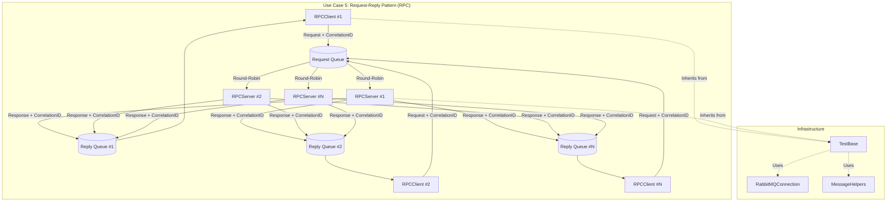
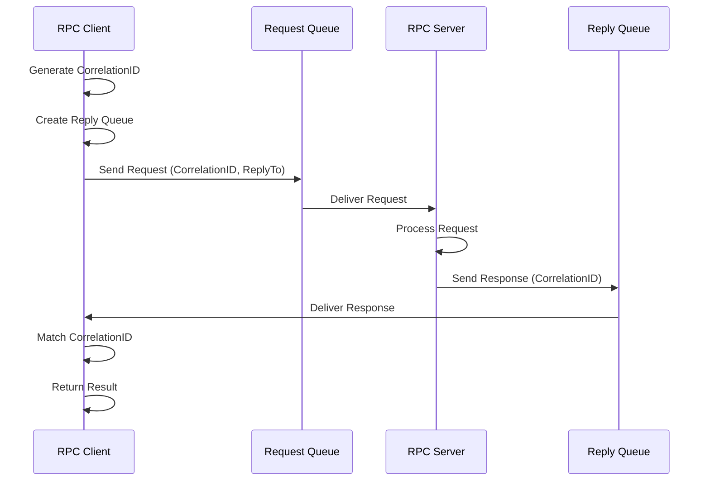
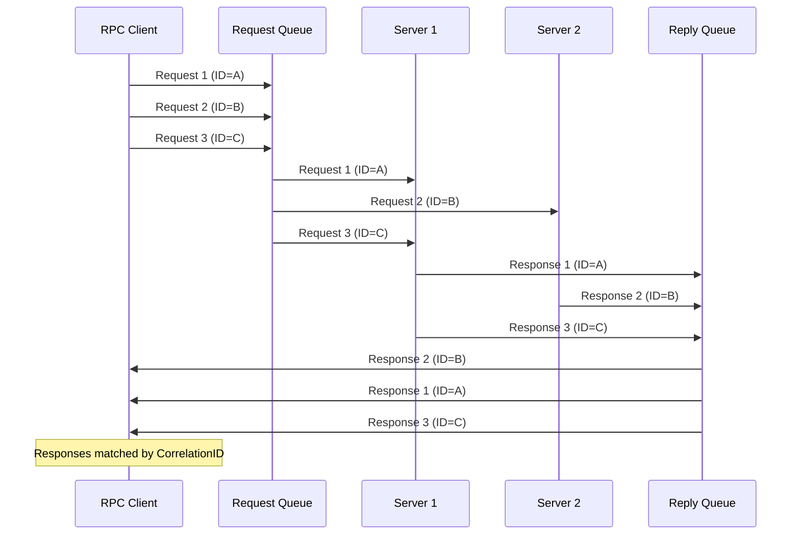
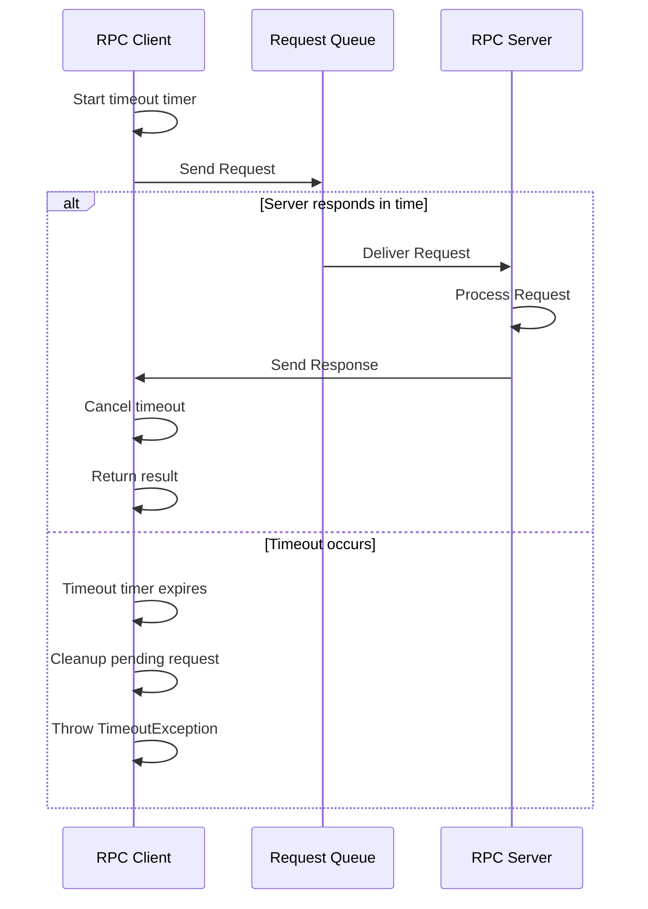
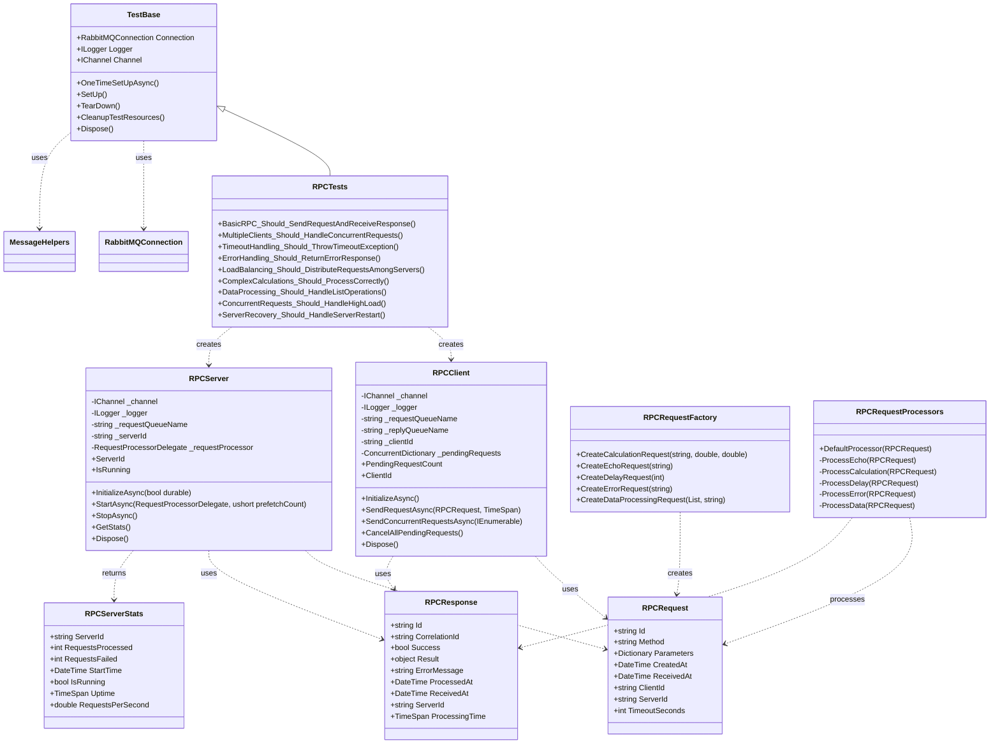

# Use Case 5: Request-Reply Pattern (RPC)

## Overview
This implementation demonstrates the **Request-Reply** messaging pattern using RabbitMQ for Remote Procedure Call (RPC) scenarios. This pattern enables synchronous communication over an asynchronous messaging infrastructure, allowing clients to send requests and wait for responses with proper correlation and timeout handling.

## Key Concepts Demonstrated

### 1. RPC Communication Flow
- Request queue for incoming RPC calls
- Temporary reply queues for responses
- Correlation IDs to match requests with responses
- Timeout handling for reliability
- Error propagation from server to client

### 2. Synchronous over Asynchronous
- **Blocking clients**: Clients wait for responses before continuing
- **Non-blocking servers**: Servers process requests asynchronously
- **Correlation matching**: Using correlation IDs to route responses
- **Temporary queues**: Exclusive reply queues per client

### 3. Load Balancing and Scalability
- **Multiple servers**: Load balancing requests across server instances
- **QoS control**: Managing server capacity with prefetch counts
- **Concurrent requests**: Handling multiple simultaneous RPC calls
- **Server statistics**: Monitoring request processing metrics

### 4. Error Handling and Reliability
- **Timeout management**: Client-side timeout for unresponsive servers
- **Error responses**: Structured error handling and propagation
- **Request acknowledgment**: Ensuring reliable message processing
- **Connection recovery**: Handling network failures gracefully

## Files Structure

```
RabbitTests/
??? UseCase5_RPC/
?   ??? RPCClient.cs              # RPC client for sending requests
?   ??? RPCServer.cs              # RPC server for processing requests
?   ??? RPCModels.cs              # Request/response models and factories
?   ??? RPCTests.cs               # Comprehensive test suite
?   ??? UseCase5_README.md        # This documentation
??? Infrastructure/
    ??? TestBase.cs               # Base test class with setup/teardown
    ??? RabbitMQConnection.cs     # Connection management utilities
    ??? MessageHelpers.cs         # Message serialization and utilities
```

## Architecture Overview



## Message Flow Patterns

### Basic RPC Request-Response


### Multiple Concurrent Requests


### Timeout Handling


## Class Relationships



## Core Classes

### RPCClient
Responsible for sending RPC requests and handling responses.

**Key Features:**
- Generate unique correlation IDs for request tracking
- Create exclusive reply queues for receiving responses
- Handle timeout scenarios with configurable timeouts
- Support concurrent requests with correlation matching
- Automatic cleanup of pending requests

**Example Usage:**
```csharp
var client = new RPCClient(channel, logger, "rpc-queue", "my-client");
await client.InitializeAsync();

var request = RPCRequestFactory.CreateCalculationRequest("add", 10, 5);
var response = await client.SendRequestAsync(request, TimeSpan.FromSeconds(10));

if (response.Success)
{
    Console.WriteLine($"Result: {response.Result}");
}
```

### RPCServer
Processes RPC requests and sends responses back to clients.

**Key Features:**
- Process requests using configurable request processors
- Support multiple server instances for load balancing
- QoS control for managing server capacity
- Request acknowledgment for reliable processing
- Comprehensive statistics and monitoring

**Example Usage:**
```csharp
var server = new RPCServer(channel, logger, "rpc-queue", "my-server");
await server.InitializeAsync(durable: false);
await server.StartAsync(RPCRequestProcessors.DefaultProcessor, prefetchCount: 5);

// Server processes requests automatically
var stats = server.GetStats();
Console.WriteLine($"Processed {stats.RequestsProcessed} requests");
```

## Test Scenarios

### 1. BasicRPC
- **Purpose**: Verify basic request-response functionality
- **Test**: Send echo request, verify response
- **Validation**: Response matches request, correlation ID works

### 2. MultipleClients
- **Purpose**: Test concurrent clients
- **Test**: 3 clients send 2 requests each concurrently
- **Validation**: All 6 responses received correctly

### 3. TimeoutHandling
- **Purpose**: Verify timeout mechanisms
- **Test**: Send request with long processing time, short timeout
- **Validation**: TimeoutException thrown, pending requests cleaned up

### 4. ErrorHandling
- **Purpose**: Test error propagation
- **Test**: Send request that causes server error
- **Validation**: Error response received with proper error message

### 5. LoadBalancing
- **Purpose**: Demonstrate server load balancing
- **Test**: 3 servers, send 9 requests
- **Validation**: Requests distributed among all servers

### 6. ComplexCalculations
- **Purpose**: Test various mathematical operations
- **Test**: Add, subtract, multiply, divide operations
- **Validation**: All calculations return correct results

### 7. DataProcessing
- **Purpose**: Test list/array operations
- **Test**: Sum, average, min, max operations on data sets
- **Validation**: All operations return correct results

### 8. ConcurrentRequests
- **Purpose**: Test high-load scenarios
- **Test**: Send 50 concurrent requests
- **Validation**: All requests processed successfully, performance metrics

### 9. ServerRecovery
- **Purpose**: Test server availability scenarios
- **Test**: Start server after client initialization
- **Validation**: Communication works after server becomes available

## Usage Examples

### Simple RPC Call
```csharp
// Setup
var server = new RPCServer(channel, logger);
var client = new RPCClient(channel, logger);

await server.InitializeAsync();
await client.InitializeAsync();
await server.StartAsync(RPCRequestProcessors.DefaultProcessor);

// Make RPC call
var request = RPCRequestFactory.CreateEchoRequest("Hello World");
var response = await client.SendRequestAsync(request);

Console.WriteLine($"Response: {response.Result}");
```

### Concurrent RPC Calls
```csharp
var requests = new List<RPCRequest>
{
    RPCRequestFactory.CreateCalculationRequest("add", 10, 5),
    RPCRequestFactory.CreateCalculationRequest("multiply", 3, 7),
    RPCRequestFactory.CreateEchoRequest("Hello"),
};

var responses = await client.SendConcurrentRequestsAsync(requests);
foreach (var response in responses)
{
    Console.WriteLine($"Result: {response.Result}");
}
```

### Custom Request Processor
```csharp
async Task<RPCResponse> CustomProcessor(RPCRequest request)
{
    return request.Method switch
    {
        "custom" => new RPCResponse 
        { 
            Success = true, 
            Result = "Custom processing result" 
        },
        _ => await RPCRequestProcessors.DefaultProcessor(request)
    };
}

await server.StartAsync(CustomProcessor);
```

### Load Balanced Servers
```csharp
// Create multiple servers
var servers = new List<RPCServer>();
for (int i = 1; i <= 3; i++)
{
    var server = new RPCServer(channel, logger, "rpc-queue", $"server-{i}");
    await server.InitializeAsync();
    await server.StartAsync(RPCRequestProcessors.DefaultProcessor);
    servers.Add(server);
}

// Requests are automatically distributed among servers
var responses = await client.SendConcurrentRequestsAsync(requests);
```

## Configuration Options

### RPCClient Configuration
- **Request Queue Name**: Queue name for sending requests
- **Client ID**: Unique identifier for the client instance
- **Timeout**: Default timeout for RPC requests
- **Reply Queue**: Exclusive queue for receiving responses

### RPCServer Configuration
- **Request Queue Name**: Queue name for receiving requests
- **Server ID**: Unique identifier for the server instance
- **Prefetch Count**: Number of unacknowledged messages per server
- **Durability**: Whether request queue survives server restarts
- **Request Processor**: Custom logic for processing requests

## Best Practices Demonstrated

1. **Correlation Management**: Proper correlation ID generation and matching
2. **Resource Cleanup**: Automatic cleanup of temporary queues and pending requests
3. **Error Handling**: Comprehensive error handling and propagation
4. **Timeout Management**: Configurable timeouts with proper cleanup
5. **Load Balancing**: Efficient distribution of requests among multiple servers
6. **Performance Monitoring**: Server statistics and performance metrics
7. **Concurrency**: Safe handling of concurrent requests and responses
8. **Reliability**: Message acknowledgment and error recovery

## Running the Tests

```bash
# Run all Use Case 5 tests
dotnet test --filter "TestFixture=RPCTests"

# Run specific test
dotnet test --filter "TestMethod=BasicRPC_Should_SendRequestAndReceiveResponse"

# Run with detailed logging
dotnet test --filter "TestFixture=RPCTests" --logger "console;verbosity=detailed"
```

## Prerequisites

- RabbitMQ server running on localhost:5672
- Admin user credentials (admin/password)
- .NET 9 runtime
- RabbitMQ.Client NuGet package

## Performance Considerations

- **Connection Reuse**: Share connections across multiple clients/servers
- **Channel Management**: Use separate channels for different operations
- **Memory Management**: Monitor pending request dictionaries for memory leaks
- **Timeout Tuning**: Set appropriate timeouts based on expected processing time
- **Prefetch Settings**: Configure prefetch counts based on server capacity
- **Queue Cleanup**: Ensure temporary queues are properly cleaned up

## Common Patterns

### Fire-and-Forget with Optional Response
```csharp
// Send request without waiting for response
var task = client.SendRequestAsync(request);
// Continue with other work
// Optionally await later: var response = await task;
```

### Request Batching
```csharp
var batchRequests = GenerateBatchRequests(100);
var batchResponses = await client.SendConcurrentRequestsAsync(batchRequests);
ProcessBatchResults(batchResponses);
```

### Streaming Results
```csharp
// For large result sets, consider streaming
var request = RPCRequestFactory.CreateDataProcessingRequest(largeDataSet, "process");
var response = await client.SendRequestAsync(request, TimeSpan.FromMinutes(5));
```

This implementation provides a comprehensive foundation for understanding RabbitMQ RPC patterns and demonstrates how to build reliable, scalable synchronous communication over asynchronous messaging infrastructure.